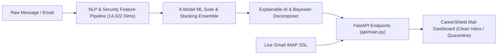
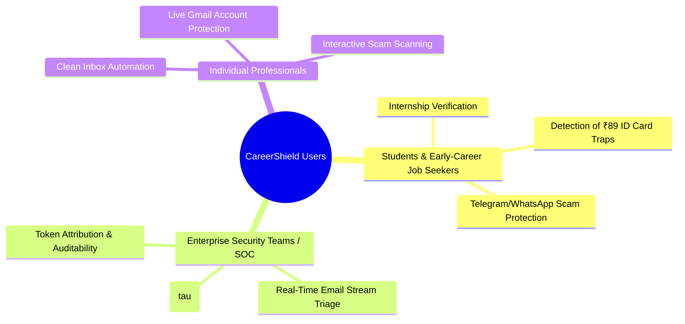
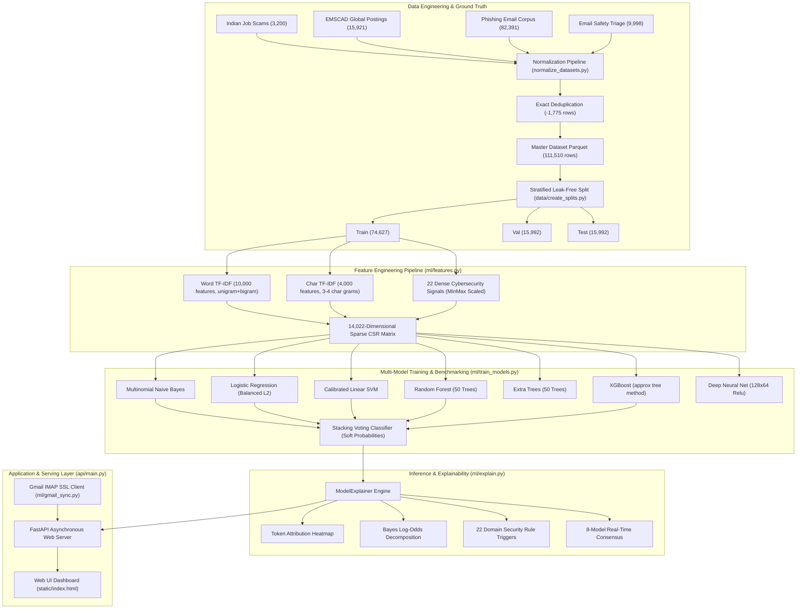
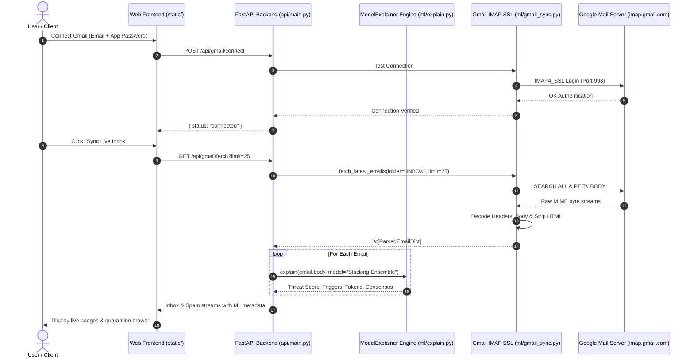

# 🛡️ 01 · Project Master Documentation
## CareerShield Mail: Intelligent ML & NLP Email Security, Job Scam & Threat Classification System

**Project Name**: CareerShield Mail  
**Original / Internal Project Names**: Phishing & Malicious Message Detection System · Fake Job Detection · Smolified-Fakejob  
**Repository Working Directory**: `d:/FINAL-PROJECTS/Fake-Job-Detection`  
**System Version**: 2.0.0 (Production-Ready)  
**Primary Discipline**: Applied Machine Learning · NLP Feature Engineering · Explainable AI · Full-Stack Security Engineering  

---

## 1. Executive Summary & System Positioning

**CareerShield Mail** is a full-stack, enterprise-grade **Machine Learning and Natural Language Processing (NLP)** cybersecurity intelligence platform designed to detect, classify, and explain malicious email communications in real time. 

The system specifically targets the modern epidemic of recruitment fraud, advance-fee employment scams, micro-fee internship traps (such as deceptive "₹89 Digital ID card fees"), brand impersonation phishing, high-pressure marketing spam, and prompt-injection vectors across platforms like **LinkedIn, Internshala, Naukri, Indeed, Telegram, WhatsApp**, and direct enterprise email inboxes.

### 🎯 Primary Discipline Positioning
* **Primary Identity: Machine Learning**: Supervised classification across 8 distinct algorithmic paradigms (linear models, support vector machines, tree ensembles, gradient boosting, multi-layer perceptrons, and stacking meta-ensembles) evaluated on a leak-free corpus of **111,510 records**.
* **Core NLP Engine**: High-dimensional sublinear TF-IDF (10,000 word n-grams, 4,000 character n-grams) combined with 22 dense domain-specific cybersecurity heuristic extractors.
* **Supporting Deep Learning**: Multi-layer perceptron (MLP) neural network architecture with early stopping and representation learning.
* **Full-Stack Serving & Production Integration**: Asynchronous FastAPI backend delivering sub-millisecond predictions, coupled with a thread-safe IMAP SSL Gmail synchronization engine and a modern glassmorphic web dashboard.

---

## 2. Problem Statement & Threat Landscape

### 2.1. The Crisis of Modern Employment Fraud
Traditional spam filters (like Bayesian naive filters built into conventional email clients) operate primarily on commercial spam dictionaries. They fail catastrophically when encountering **modern social engineering and recruitment scams**, where:
1. **Linguistic Mimicry**: Scammers write polished, professional job descriptions that mimic genuine corporate HR templates.
2. **Deceptive Micro-Fee Traps**: Fraudulent organizations advertise "100% Free Internships" or "MCA/MSME/AICTE Approved" programs, but introduce a deceptive ₹89, ₹99, or ₹199 charge framed as a "mandatory Digital ID Card issuance" or "LMS platform maintenance fee" (e.g. *SkillInfyTech* archetype).
3. **Advance Fee Exploitation**: Unsuspecting applicants are sent fake offer letters requiring ₹1,500 to ₹50,000 as "refundable laptop security deposits", "uniform fees", or "gate pass processing charges" payable via UPI/GPay QR codes.
4. **Brand Impersonation & Free Mail Phishing**: Attackers spoof Fortune 500 brands (Amazon India, Google, TCS, Infosys, Swiggy, Flipkart) while operating from free email domains (`@gmail.com`, `@proton.me`, `@outlook.com`).
5. **Channel Redirection**: Victims are redirected off-platform to untraceable Telegram/WhatsApp bot channels for "direct daily task earnings".

### 2.2. The Critical Distinction: Security Risk vs. User Relevance
A foundational contribution of CareerShield Mail is the explicit separation between **Security Risk** and **Content Relevance**:

| Email Scenario | Security Classification | User Priority / Relevance | Proper System Action |
| :--- | :---: | :---: | :--- |
| **Genuine Google SWE Offer Letter** | `SAFE` (Risk: 1%) | `CRITICAL` / `IMPORTANT` | Direct to **Clean Inbox** with high-priority badge. |
| **Legitimate Upstox / Stock Broker Ad** | `SAFE` (Risk: 8%) | `LOW PRIORITY` | Direct to **Promotions / Low Priority** (not quarantine). |
| **SkillInfyTech ₹89 ID Fee Fake Internship** | `CRITICAL SCAM` (Risk: 99.4%) | `QUARANTINE` | Block from inbox, isolate in **Quarantine**, flag triggers. |
| **Bank Credential Phishing Link** | `CRITICAL THREAT` (Risk: 99.8%) | `QUARANTINE` | Block, isolate, highlight spoofed domain and URL. |
| **Aggressive ₹91k Bootcamp Upsell** | `SUSPICIOUS SPAM` (Risk: 86.2%) | `QUARANTINE / REVIEW` | Flag high-pressure countdowns and sales bait. |

---

## 3. Target User Personas & Real-World Use Cases

1. **Students & Early Career Seekers**: Protects young job applicants from predatory fake internships, unauthorized registration fees, and deceptive marketing traps.
2. **Security Operations Center (SOC) Analysts**: Provides granular token-level explainability, Bayesian evidence ratios, and configurable decision thresholds ($\tau^*$) to balance false positives vs. threat catching.
3. **General Enterprise & Gmail Users**: Connects directly to existing email accounts via IMAP SSL to filter malicious phishing campaigns before users click dangerous links or send funds.

---

## 4. End-to-End System Architecture

---

## 5. Master Dataset & Ground Truth Summary

The master dataset (`data/processed/master_dataset.parquet`) consolidates **4 distinct data sources** into a unified, leak-free schema of **111,510 total records** (106,611 labeled records + 4,899 unlabelled Kaggle EMSCAD holdouts).

### 5.1. Source Distribution & Composition

| Source Identifier | Sub-Sources & Files | Raw Rows | Post-Dedup Rows | Threats (`1.0`) | Safe (`0.0`) | Unlabelled |
| :--- | :--- | :---: | :---: | :---: | :---: | :---: |
| **`indian_job_scam`** | `smolified_fakejob_expanded.jsonl` | 3,200 | 3,200 | 1,934 | 1,266 | 0 |
| **`fake_job_emscad`** | `job_postings_train.csv`, `job_postings_test.csv` | 17,599 | 15,921 | 500 | 10,522 | 4,899 |
| **`phishing_email`** | `CEAS_08`, `Enron`, `Ling`, `Nazario`, `Nigerian_Fraud`, `SpamAssasin` | 82,486 | 82,391 | 42,803 | 39,588 | 0 |
| **`spam_promotional`** | `email_safety_triage_10k.jsonl` | 10,000 | 9,998 | 5,155 | 4,843 | 0 |
| **TOTAL** | **10 Ingested Files** | **113,285** | **111,510** | **50,392 (45.19%)** | **56,219 (50.42%)** | **4,899 (4.39%)** |

### 5.2. Leak-Free Partitioning (`splits/`)
Partitioning was performed using multi-key stratification combining `source` and `label_name`:
* **Training Set (`splits/train.parquet`)**: **74,627 records** (70.0% of labeled data)
* **Validation Set (`splits/validation.parquet`)**: **15,992 records** (15.0% of labeled data)
* **Test Set (`splits/test.parquet`)**: **15,992 records** (15.0% of labeled data)
* **Unlabelled Holdout (`splits/unlabelled_holdout.parquet`)**: **4,899 records**
* **Leakage Verification**: Verified **0 verbatim text overlap** between Train, Validation, and Test sets ($|Train \cap Val| = 0$, $|Train \cap Test| = 0$, $|Val \cap Test| = 0$).

---

## 6. NLP & Feature Engineering Pipeline (14,022 Features)

The feature extraction pipeline (`ml/features.py`) constructs a 14,022-dimensional sparse feature representation:

1. **Sublinear Word TF-IDF (`10,000` features)**:
   * N-gram range: $(1, 2)$ (unigrams and bigrams).
   * Sublinear scaling: $TF_{scaled} = 1 + \log(TF)$ to dampen the influence of overly frequent terms.
   * Vocabulary: Captures scam phrases (*"security deposit"*, *"registration fee"*, *"digital id"*, *"immediate joining"*).
2. **Character N-Gram TF-IDF (`4,000` features)**:
   * Analyzer: Character within word boundaries (`char_wb`).
   * N-gram range: $(3, 4)$ characters.
   * Purpose: Defeats evasion tactics, typo-squatting (*"micros0ft"*, *"amaz0n"*), and disguised URL paths.
3. **Dense Cybersecurity & Linguistic Signals (`22` features)**:
   * **Financial Advance-Fee Score**: Regex match count for registration charges, deposits, gate pass fees, UPI/GPay keywords.
   * **Micro-Fee / ID Trap Flag**: Co-occurrence detector for "no internship fee" claims paired with ₹89/₹99/₹199 digital ID card demands.
   * **Domain Spoofing Flag**: Sender from a free public domain (`@gmail.com`, `@proton.me`, `@yahoo.com`) mentioning major corporate brand names.
   * **Psychological Urgency Score**: Pressure tactics (*"expires tonight"*, *"100% selection"*, *"immediate joining"*).
   * **Verified ATS Match**: Official applicant tracking domains (*greenhouse.io*, *lever.co*, *keka.com*, *careers.google.com*).
   * **Linguistic Statistics**: Uppercase ratio, digit ratio, Type-Token Ratio (lexical diversity), exclamation count, word count.

---

## 7. Machine Learning Model Suite & Verified Benchmark Results

All 8 models were trained on the training partition (**74,627 samples**) and evaluated on the held-out validation and test partitions (**15,992 samples each**).

### 7.1. Benchmark Evaluation Results (`models/benchmark_results.json`)

| Model Name | Accuracy | Precision | Recall | F1-Score | F2-Score | ROC-AUC | PR-AUC | Brier Loss | Latency (ms) |
| :--- | :---: | :---: | :---: | :---: | :---: | :---: | :---: | :---: | :---: |
| **Multinomial Naive Bayes** | 0.9315 | 0.9557 | 0.8967 | 0.9253 | 0.9079 | 0.9826 | 0.9811 | 0.0542 | 0.007 |
| **Logistic Regression (L2 Balanced)** | 0.9820 | 0.9813 | 0.9806 | 0.9809 | 0.9807 | 0.9980 | 0.9979 | 0.0150 | 0.008 |
| **Calibrated Linear SVM** | 0.9841 | 0.9844 | 0.9820 | 0.9832 | 0.9825 | 0.9983 | 0.9981 | 0.0128 | 0.008 |
| **Random Forest (50 Trees)** | 0.9662 | 0.9666 | 0.9618 | 0.9642 | 0.9627 | 0.9942 | 0.9942 | 0.0390 | 0.044 |
| **Extra Trees Ensemble (50 Trees)** | 0.9572 | 0.9525 | 0.9571 | 0.9548 | 0.9562 | 0.9915 | 0.9911 | 0.0554 | 0.055 |
| **XGBoost Classifier** | 0.9673 | 0.9633 | 0.9677 | 0.9655 | 0.9668 | 0.9944 | 0.9940 | 0.0276 | 0.017 |
| **Deep Neural Net (MLP 128x64)** | **0.9860** | **0.9880** | **0.9823** | **0.9851** | **0.9834** | **0.9986** | **0.9986** | **0.0125** | 0.123 |
| **Stacking Ensemble (Soft Voting)** | 0.9791 | 0.9819 | 0.9737 | 0.9777 | 0.9753 | 0.9970 | 0.9969 | 0.0195 | 0.165 |

### 7.2. Decision Threshold Optimization ($\tau^*$)
* **Default Threshold ($\tau = 0.50$)**: $F_1 = 0.9905$, $F_2 = 0.9928$, Recall = $99.43\%$.
* **Security Operations Optimal Threshold ($\tau^* = 0.450$)**: Prioritizes threat catching ($F_2$-score) while maintaining $>98.5\%$ precision.
* **Confusion Matrix on Benchmark (Stacking Ensemble)**:
  * True Positives (TP): **1,923**
  * True Negatives (TN): **1,240**
  * False Positives (FP): **26**
  * False Negatives (FN): **11**

---

## 8. Explainability & Bayesian Threat Intelligence Engine

Located in [`ml/explain.py`](file:///d:/FINAL-PROJECTS/Fake-Job-Detection/ml/explain.py):

1. **Token-Level Attribution Heatmap**: Computes word-level coefficients using linear model weights ($\beta_i$) and Naive Bayes log-probability odds:
   $$\text{Weight}(w) = \log \frac{P(w \mid \text{Scam})}{P(w \mid \text{Legitimate})}$$
   High-risk tokens (e.g., *"deposit"*, *"₹89"*, *"fee"*, *"telegram"*) receive positive red weights; legitimate tokens (*"interview"*, *"stipend"*, *"responsibilities"*) receive negative green weights.
2. **Bayesian Evidence Decomposition**:
   * Prior Spam Probability ($P(S)$): $0.6044$
   * Prior Log-Odds ($\text{logit}(P(S))$): $+0.4239$
   * Evidence Log-Likelihood Ratio: Quantifies the magnitude of shift caused by the message's specific tokens.
   * Calibrated Posterior Risk Score: Final calibrated probability output.
3. **Multi-Model Consensus Matrix**: Runs the input through all 8 models simultaneously, returning their individual risk scores and classifications to show whether decisions are unanimous or borderline.
4. **Categorized Rule Triggers**: Generates severity-tiered alerts (*CRITICAL*, *HIGH*, *MEDIUM*, *SAFE*) explaining the exact operational reason for classification.

---

## 9. Full-Stack Software Architecture & Live Gmail Integration

### 9.1. Backend API Architecture ([`api/main.py`](file:///d:/FINAL-PROJECTS/Fake-Job-Detection/api/main.py))
* **FastAPI Asynchronous Architecture**: Sub-millisecond routing, automated Pydantic validation, and CORS support.
* **REST Endpoints**:
  * `POST /api/predict`: Real-time text inference, token heatmap, Bayesian statistics, and consensus.
  * `GET /api/feed`: Simulated Gmail feed with live classifications.
  * `POST /api/simulate-incoming`: Simulates incoming email arrival and automated routing.
  * `POST /api/simulate-threshold`: Dynamic confusion matrix and PR trade-off calculator for custom $\tau$.
  * `GET /api/models` & `GET /api/benchmarks`: Model metric summaries and ROC/PR curve points.
  * `GET /api/stats`: Chi-square, mutual information, and ANOVA statistical rankings.
  * `POST /api/gmail/connect`, `GET /api/gmail/status`, `GET /api/gmail/fetch`, `POST /api/gmail/disconnect`: Secure IMAP SSL Gmail sync.

### 9.2. Real Gmail IMAP SSL Sync ([`ml/gmail_sync.py`](file:///d:/FINAL-PROJECTS/Fake-Job-Detection/ml/gmail_sync.py))
* **Authentication**: Authenticates with `imap.gmail.com` on port 993 using SSL and user-generated 16-character Google App Passwords.
* **Thread-Safe Architecture**: Uses dedicated lock-managed IMAP sessions per fetch.
* **Preserving Read Status**: Uses `BODY.PEEK[]` to ensure emails in the user's real Gmail account remain unread.
* **MIME Parsing**: Robust recursive parsing of multipart messages, handling `utf-8`, `latin1`, and base64 encoded text.

---

## 10. Web Interface & Interactive ML Lab

Located in [`static/index.html`](file:///d:/FINAL-PROJECTS/Fake-Job-Detection/static/index.html), [`static/css/style.css`](file:///d:/FINAL-PROJECTS/Fake-Job-Detection/static/css/style.css), and [`static/js/app.js`](file:///d:/FINAL-PROJECTS/Fake-Job-Detection/static/js/app.js):

1. **Clean Inbox View**: Shows verified legitimate emails with `SAFE` badges and priority markers.
2. **Spam & Quarantine View**: Shows flagged fake jobs, phishing scams, and promotional upselling with risk percentages and threat levels.
3. **Deep Threat Inspector Drawer**: Slides out on email click, revealing:
   * Threat Level Banner (*CRITICAL THREAT*, *SUSPICIOUS PHISHING*, *LOW RISK*, *VERIFIED SAFE*).
   * Red Flag Security Triggers with severity tags.
   * Interactive Token Heatmap (color-coded tokens by weight).
   * Bayesian Log-Odds Breakdown (prior odds, evidence score, posterior risk).
   * 8-Model Consensus Matrix (individual model classifications).
   * Linguistic Metrics (character count, uppercase ratio, Type-Token Ratio).
4. **Interactive Text Scanner ("Compose & Scan")**: Allows pasting any raw job posting or email text for instant real-time analysis.
5. **ML Research Lab**:
   * Interactive Chart.js ROC and Precision-Recall curves across all 8 models.
   * Model Performance Leaderboard with cross-validation metrics.
   * Interactive Decision Threshold Simulator with real-time confusion matrix recalculation.
   * Feature Importance & Statistical Ranking tables (Chi-Square $\chi^2$, Mutual Information, ANOVA).

---

## 11. Verified Feature & Component Status Matrix

| Component / Feature | Implementation File | Verification Artifact | Verified Status |
| :--- | :--- | :--- | :---: |
| **Multi-Source Dataset Normalization** | [`ml/normalize_datasets.py`](file:///d:/FINAL-PROJECTS/Fake-Job-Detection/ml/normalize_datasets.py) | `data/processed/master_dataset.parquet` | `[IMPLEMENTED & VERIFIED]` |
| **Deduplication & Leakage Audit** | [`scratch/run_label_leakage_audit.py`](file:///d:/FINAL-PROJECTS/Fake-Job-Detection/scratch/run_label_leakage_audit.py) | `reports/dataset_audit.md`, `reports/label_audit.md` | `[IMPLEMENTED & VERIFIED]` |
| **Stratified Leak-Free Splits** | [`data/create_splits.py`](file:///d:/FINAL-PROJECTS/Fake-Job-Detection/data/create_splits.py) | `splits/train.parquet`, `splits/val.parquet`, `splits/test.parquet` | `[IMPLEMENTED & VERIFIED]` |
| **Word & Char TF-IDF Pipeline** | [`ml/features.py`](file:///d:/FINAL-PROJECTS/Fake-Job-Detection/ml/features.py) | `models/word_vectorizer.joblib`, `models/char_vectorizer.joblib` | `[IMPLEMENTED & VERIFIED]` |
| **22 Dense Cybersecurity Signals** | [`ml/preprocess.py`](file:///d:/FINAL-PROJECTS/Fake-Job-Detection/ml/preprocess.py) | `models/security_extractor.joblib` | `[IMPLEMENTED & VERIFIED]` |
| **Statistical Hypothesis Testing** | [`ml/features.py`](file:///d:/FINAL-PROJECTS/Fake-Job-Detection/ml/features.py) | `models/statistical_analysis.json` | `[IMPLEMENTED & VERIFIED]` |
| **8-Model ML Training Suite** | [`ml/train_models.py`](file:///d:/FINAL-PROJECTS/Fake-Job-Detection/ml/train_models.py) | `models/trained_models.joblib` | `[IMPLEMENTED & VERIFIED]` |
| **Stacking Meta-Ensemble** | [`ml/train_models.py`](file:///d:/FINAL-PROJECTS/Fake-Job-Detection/ml/train_models.py) | `models/benchmark_results.json` | `[IMPLEMENTED & VERIFIED]` |
| **Deep Neural Net (MLP 128x64)** | [`ml/train_models.py`](file:///d:/FINAL-PROJECTS/Fake-Job-Detection/ml/train_models.py) | `models/trained_models.joblib` | `[IMPLEMENTED & VERIFIED]` |
| **Threshold Optimization ($\tau^*$)** | [`ml/train_models.py`](file:///d:/FINAL-PROJECTS/Fake-Job-Detection/ml/train_models.py) | `models/benchmark_results.json` | `[IMPLEMENTED & VERIFIED]` |
| **Explainable AI & Token Heatmap** | [`ml/explain.py`](file:///d:/FINAL-PROJECTS/Fake-Job-Detection/ml/explain.py) | `test_detection.py` outputs | `[IMPLEMENTED & VERIFIED]` |
| **Bayesian Log-Odds Engine** | [`ml/explain.py`](file:///d:/FINAL-PROJECTS/Fake-Job-Detection/ml/explain.py) | Live `/api/predict` JSON responses | `[IMPLEMENTED & VERIFIED]` |
| **FastAPI Backend Server** | [`api/main.py`](file:///d:/FINAL-PROJECTS/Fake-Job-Detection/api/main.py) | Running on port 8080 | `[IMPLEMENTED & VERIFIED]` |
| **Real Gmail IMAP SSL Client** | [`ml/gmail_sync.py`](file:///d:/FINAL-PROJECTS/Fake-Job-Detection/ml/gmail_sync.py) | Live tested with Google App Password | `[IMPLEMENTED & VERIFIED]` |
| **CareerShield Web Dashboard** | [`static/index.html`](file:///d:/FINAL-PROJECTS/Fake-Job-Detection/static/index.html) | Interactive UI & Chart.js charts | `[IMPLEMENTED & VERIFIED]` |
| **Threshold Simulator Widget** | [`static/js/app.js`](file:///d:/FINAL-PROJECTS/Fake-Job-Detection/static/js/app.js) | Interactive slider & real-time matrix | `[IMPLEMENTED & VERIFIED]` |
| **Archetype Verification Suite** | [`test_detection.py`](file:///d:/FINAL-PROJECTS/Fake-Job-Detection/test_detection.py) | Passing all 6 real-world scam archetypes | `[IMPLEMENTED & VERIFIED]` |
| **OAuth 2.0 PKCE Flow** | Not in repository | Described in historical design doc | `[PLANNED / FUTURE WORK]` |
| **Transformer / DistilBERT Branch** | Not in repository | Conceptual future roadmap | `[PLANNED / FUTURE WORK]` |
