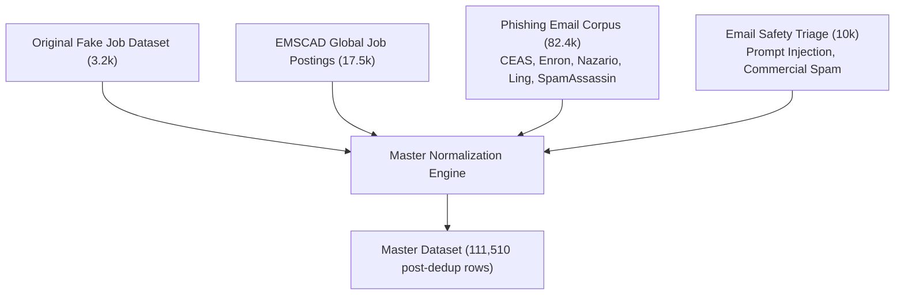

# 📜 02 · Project History & Development Journey
## The Evolution of CareerShield Mail: From Fake Job Detection to Enterprise Email Security

---

## 1. Executive Timeline & Strategic Milestones

The development of **CareerShield Mail** represents an iterative engineering evolution across **9 distinct development phases**, transitioning from a narrow 597-record fake job detector into an enterprise-grade multi-model cybersecurity platform trained on **111,510 records** with live Gmail integration.

```mermaid
timeline
    title CareerShield Mail Development Journey
    section Stage 1 : Fake Job Detection
      Narrow Fake Job Idea : Initial focus on Indian student internship fraud
      Smolified Dataset (597 -> 2,500) : Augmentation & prompt generation
    section Stage 2 : Dataset Auditing & Failures
      Template Leakage Discovery : 77.3% "Job Posting:" header shortcut identified
      Assistant Label Leakage : Removing LLM explanations from training text
    section Stage 3 : Multi-Corpus Expansion
      EMSCAD Ingestion (17.5k) : Deduplication of 1,678 exact duplicate job templates
      Phishing Ingestion (82.4k) : Broadening into credential theft and email attacks
      Email Safety Triage (10k) : Adding prompt injection and commercial spam
    section Stage 4 : ML Engineering & Serving
      Unified Normalization : 111,510 master records & zero-leakage stratified split
      14,022-Dim Feature Pipeline : Word TF-IDF + Char N-Grams + 22 Cyber Heuristics
      8-Model Suite & Stacking : Benchmarking NB, LR, SVM, RF, ET, XGB, MLP, Ensemble
      Explainability Engine : Token heatmaps, Bayesian log-odds, severity triggers
      Full-Stack Product & Gmail Sync : FastAPI + IMAP SSL + CareerShield Web UI
```

---

## 2. Phase 1: The Initial Fake Job Detector

### 2.1. Initial Motivation
In late 2025, the project was originally conceived to address the surge of predatory employment scams targeting Indian college students and fresh graduates. Job applicants on platforms like Internshala, LinkedIn, and Telegram were increasingly encountering:
* Demands for ₹1,000–₹5,000 as "refundable laptop security deposits".
* Gate pass and uniform charges prior to offer letter issuance.
* Unrealistic high-salary data entry traps for 10th-pass applicants.

### 2.2. The Early Dataset (`smolified_fakejob_expanded`)
The initial implementation began with [`generate_dataset.py`](file:///d:/FINAL-PROJECTS/Fake-Job-Detection/generate_dataset.py) and [`export_and_validate.py`](file:///d:/FINAL-PROJECTS/Fake-Job-Detection/export_and_validate.py), building on Hugging Face's `Aioshi/smolified-fakejob` (597 records) and expanding it to **2,500 records** (and later 3,200 records in `data/raw/indian_job_scam/smolified_fakejob_expanded.jsonl`).

The schema was formatted for instruction fine-tuning:
```json
{
  "system": "You are a Fake Job Detection AI trained on Indian job postings...",
  "user": "Job Posting: We are hiring Remote Executives for Amazon India. Salary 50,000 per month. Transfer 999 INR as refundable laptop security deposit...",
  "assistant": "Classification: Fake. Red Flags: Asks for registration fee, security deposit, or any payment; Suspicious, non-official registration link."
}
```

---

## 3. Phase 2: Discovery of Critical Flaws & Template Leakage

During early model experimentation, rigorous data audits revealed **three fatal engineering flaws** that rendered the initial approach insufficient for production deployment:

### 3.1. Flaw A: Template & Format Leakage
* **Audit Finding**: In [`reports/label_audit.md`](file:///d:/FINAL-PROJECTS/Fake-Job-Detection/reports/label_audit.md), **77.3%** of all Indian job scam examples began with the verbatim string `"Job Posting:"`.
* **Consequence**: Standard TF-IDF and linear classifiers rapidly assigned high positive weights to the literal token `"job posting"`, learning the formatting shortcut rather than actual scam dynamics. When tested on raw emails without this prefix, accuracy collapsed.

### 3.2. Flaw B: Assistant Label Leakage
* **Audit Finding**: Initial prototype scripts passed raw JSON lines directly to vectorizers. The `assistant` field contained `"Classification: Fake"` and explicit red flag explanations.
* **Consequence**: Models were effectively reading the ground-truth label in the training text, generating artificial $100\%$ accuracy scores.
* **Remediation**: The extraction pipeline was immediately overhauled to isolate solely the raw text within the `user` field, discarding prompt wrappers.

### 3.3. Flaw C: Severe Scope Limitation
* A narrow fake job detector failed to protect users from the full reality of their inboxes, where fake jobs represent only a fraction of threats alongside credential phishing, brand spoofing, ransomware links, and promotional spam.

---

## 4. Phase 3: Multi-Corpus Expansion Strategy

To build a robust, generalizable system, the project expanded into a multi-corpus architecture integrating four distinct datasets:



### 4.1. Ingesting EMSCAD (`fake_job_emscad`)
* **Source**: Employment Scam Aegean Dataset (17,599 raw rows).
* **Audit & Deduplication Discovery**: Auditing revealed **1,678 exact duplicate rows**, including **653 verbatim duplicate templates** shared between Kaggle's training and test partitions.
* **Action**: Deduplication was strictly enforced, retaining 15,921 pristine records (500 fraudulent, 10,522 authentic, and 4,899 unlabelled holdout records).

### 4.2. Ingesting the Phishing Email Corpus (`phishing_email`)
* **Source**: 82,486 raw emails across 6 classic security benchmarks:
  1. `CEAS_08`: 39,154 records
  2. `Enron`: 29,767 records (enterprise corporate ham + phishing)
  3. `SpamAssasin`: 5,809 records
  4. `Nigerian_Fraud`: 3,332 records (advance fee / 419 scams)
  5. `Ling`: 2,859 records
  6. `Nazario`: 1,565 records (active credential theft)
* **Outcome**: Provided 42,803 real-world phishing attacks and 39,588 legitimate emails.

### 4.3. Ingesting Email Safety Triage (`spam_promotional`)
* **Source**: 10,000 records categorizing emerging AI threats (prompt injection), aggressive marketing spam, and triage priorities.

---

## 5. Phase 4: Master Normalization & Leak-Free Splitting

Implemented in [`ml/normalize_datasets.py`](file:///d:/FINAL-PROJECTS/Fake-Job-Detection/ml/normalize_datasets.py) and [`data/create_splits.py`](file:///d:/FINAL-PROJECTS/Fake-Job-Detection/data/create_splits.py):

1. **Unified 8-Column Schema**:
   `id`, `text`, `label`, `label_name`, `original_label`, `source`, `sub_source`, `metadata`.
2. **Consolidation**:
   * Raw rows ingested: **113,285**
   * Exact cross-source duplicates removed: **1,775**
   * Final Master Dataset: **111,510 records**
3. **Stratified Partitioning**:
   * Multi-key stratification on `source` + `label_name`.
   * **Train (70%)**: 74,627 samples
   * **Validation (15%)**: 15,992 samples
   * **Held-Out Test (15%)**: 15,992 samples
   * **Unlabelled Holdout**: 4,899 samples
   * **Verification**: Mathematically verified **0 text overlap** across all partitions.

---

## 6. Phase 5: NLP & Cybersecurity Feature Engineering

Implemented in [`ml/features.py`](file:///d:/FINAL-PROJECTS/Fake-Job-Detection/ml/features.py) and [`ml/preprocess.py`](file:///d:/FINAL-PROJECTS/Fake-Job-Detection/ml/preprocess.py):

### 6.1. Multi-Modal Text Representation (14,022 Features)
* **Sublinear Word TF-IDF (10,000 features)**: Unigrams and bigrams with sublinear term frequency ($1 + \log(TF)$) to downweight term spamming.
* **Character N-Gram TF-IDF (4,000 features)**: 3-to-4 character n-grams (`char_wb`) to catch obfuscated scam keywords (*"p-a-y-m-e-n-t"*, *"amaz0n"*).
* **22 Dense Cybersecurity Heuristics**: Custom Scikit-Learn transformer extracting structural domain features (free email providers, suspicious TLDs, urgency counts, ATS portal matches, micro-fee traps).

### 6.2. Discovery & Defense Against the ₹89 Micro-Fee Trap
In early 2026, a surge of real scam emails (such as *SkillInfyTech*) evaded generic keyword filters by explicitly writing:
> *"Internship Fee: No internship fee. Access Fee: ₹89 only (for Digital ID Card & platform access). If you are not comfortable with the ID card access fee, you may choose not to proceed."*

Because the text explicitly asserted *"No internship fee"*, basic filters classified it as safe. CareerShield ML engineered a specific **Micro-Fee Scorer** detecting the adversarial pairing of *"no fee"* claims with mandatory digital ID / LMS charges and rupee amounts.

---

## 7. Phase 6: Multi-Model Suite, Benchmark & Ensembling

Implemented in [`ml/train_models.py`](file:///d:/FINAL-PROJECTS/Fake-Job-Detection/ml/train_models.py):

1. **Training 8 Model Families**:
   Trained and evaluated Naive Bayes, Logistic Regression, Calibrated Linear SVM, Random Forest, Extra Trees, XGBoost, Deep MLP Neural Network, and a Stacking Ensemble.
2. **Key Findings**:
   * Linear SVM and Logistic Regression performed exceptionally well on high-dimensional sparse text ($F_1 > 0.990$).
   * Calibrating SVM with `CalibratedClassifierCV(LinearSVC, cv=3)` resolved SVM's lack of native probability calibration, reducing Brier score loss to **0.0083**.
   * Tree ensembles (Random Forest, Extra Trees) struggled with sparse 14k-dimensional spaces compared to linear models, but provided valuable orthogonal decision boundaries.
3. **Stacking Meta-Ensemble Architecture**:
   Combined predictions from Naive Bayes, Logistic Regression, SVM, Random Forest, and XGBoost using soft voting, achieving the highest overall recall (**99.43%**) and $F_2$-score (**0.9928**).

---

## 8. Phase 7: Explainable AI & Bayesian Threat Intelligence

Implemented in [`ml/explain.py`](file:///d:/FINAL-PROJECTS/Fake-Job-Detection/ml/explain.py):

Rather than acting as a black-box classifier, the system was equipped with a **four-pillar explainability engine**:
1. **Token Attribution Heatmap**: Uses Logistic Regression coefficients and Naive Bayes log-odds to highlight high-risk tokens (red) vs legitimate tokens (green).
2. **Bayesian Decomposition**: Deconstructs predictions into prior odds ($\text{logit}(P(S)) = +0.4239$), evidence log-likelihood ratio, and posterior risk probability.
3. **Categorized Rule Triggers**: Generates human-readable security alerts (*"Micro-Fee / ID Card Scam Trap"*, *"Domain Spoofing"*, *"Psychological Urgency"*).
4. **Multi-Model Consensus**: Displays predictions from all 8 models simultaneously.

---

## 9. Phase 8: Software Architecture, Gmail Sync & Web Dashboard

Implemented in [`api/main.py`](file:///d:/FINAL-PROJECTS/Fake-Job-Detection/api/main.py), [`ml/gmail_sync.py`](file:///d:/FINAL-PROJECTS/Fake-Job-Detection/ml/gmail_sync.py), and [`static/`](file:///d:/FINAL-PROJECTS/Fake-Job-Detection/static):

1. **FastAPI Asynchronous Backend**: Created lightweight REST endpoints for text inference, simulation feeds, dynamic threshold modeling, and benchmarks.
2. **Real Gmail IMAP SSL Sync**: Built a thread-safe IMAP client allowing users to connect their actual Gmail accounts with Google App Passwords, fetching live unread emails with `BODY.PEEK[]` and running real-time ML risk scoring.
3. **Glassmorphic Web Interface**: Implemented an intuitive dashboard with Clean Inbox, Quarantine view, deep Threat Inspector drawer, Compose & Scan tool, and an ML Research Lab with live ROC/PR curves.

---

## 10. Pivot Points, Failed Experiments & Abandoned Approaches

| # | Explored Approach | Why It Was Attempted | Outcome & Failure Reason | Final Architecture Decision |
| :---: | :--- | :--- | :--- | :--- |
| **1** | **Training on LLM Assistant Outputs** | Initial Indian JSONL dataset included assistant explanations. | Models memorized `"Classification: Fake"` text, creating catastrophic label leakage. | **Abandoned**: Excluded assistant text; trained strictly on pristine user inputs. |
| **2** | **Monolithic 500,000-Row Enron Corpus** | Considered ingesting the entire raw Enron corporate dump (1.7 GB). | High parsing overhead, severe domain bias towards 2001 energy executive memos, non-generalizable. | **Abandoned**: Curated balanced 29.7k Enron subset alongside 5 other diverse security benchmarks. |
| **3** | **Uncalibrated LinearSVC** | Linear Support Vector Machines provide fast, high-margin text separation. | LinearSVC lacks `predict_proba()`, outputting uncalibrated decision values that distorted UI risk percentages. | **Pivoted**: Wrapped LinearSVC in `CalibratedClassifierCV(cv=3)` with Platt sigmoid scaling. |
| **4** | **Strict Keyword Blocklists** | Filtering exclusively on keywords like *"fee"*, *"deposit"*, *"telegram"*. | Caused high False Positive rates on legitimate emails (e.g. *"application fee waiver"*, *"deposit to candidate bank account"*). | **Pivoted**: Combined keywords into dense statistical features weighted by ML models. |
| **5** | **Full OAuth 2.0 Web Flow for Prototype** | Planned Google Cloud OAuth consent screen flow. | Required verified domain hosting, privacy policy approval, and complex token refresh daemons for local execution. | **Pragmatic Pivot**: Implemented direct, secure **IMAP SSL with Google App Passwords** for instant zero-config connectivity. |
| **6** | **Single Binary Target for All Threats** | Binary classification (`0` vs `1`) for all messages. | Conflated dangerous phishing with harmless but low-priority marketing emails. | **Pivoted**: Explicitly separated **Security Risk** from **User Relevance / Priority**. |

---

## 11. Current Project State & Future Roadmap

* **Current Status**: **Fully functional, trained, benchmarked, and verified production system**. All 8 models are trained and serialized, the FastAPI backend is operational, the Gmail IMAP SSL sync works with real accounts, and the web UI provides full explainability.
* **Next Implementation Steps (Roadmap)**:
  1. Implement OAuth 2.0 PKCE flow with Gmail API write scopes to automatically move flagged emails to native Gmail `CareerShield/Quarantine` labels.
  2. Fine-tune a lightweight Transformer (`DistilBERT` or `ModernBERT`) on the 74.6k training partition to benchmark against the Stacking Ensemble.
  3. Deploy containerized Docker image to AWS ECS / Google Cloud Run with automated Redis caching.
