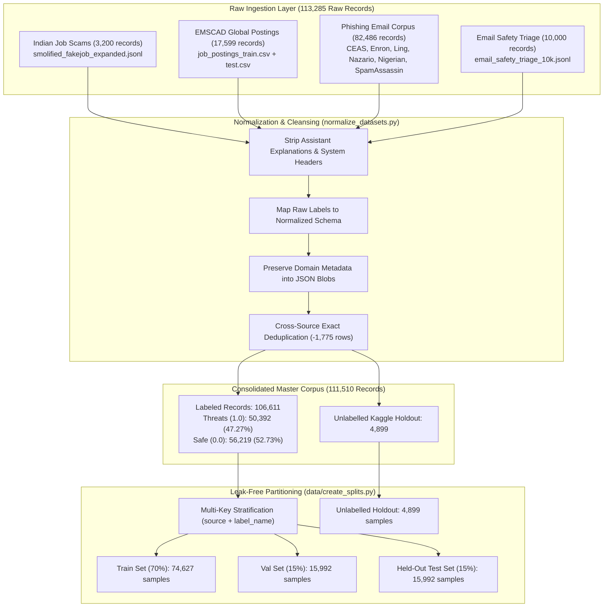
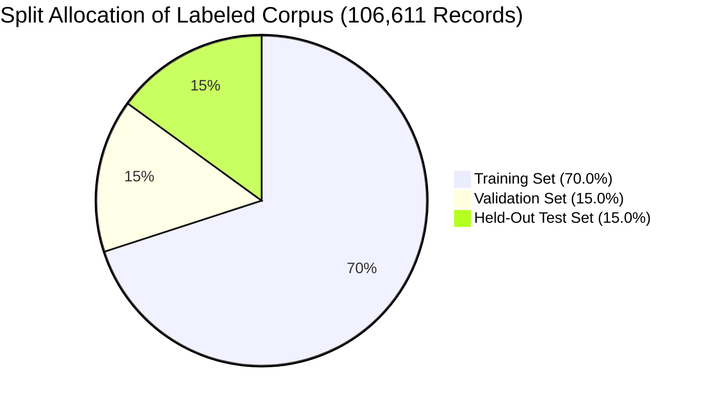

# 📊 03 · Datasets, Data Engineering & Exploratory Data Analysis (EDA)
## Multi-Source Corpus Normalization, Leakage Auditing, Stratified Partitioning & Statistical Testing

---

## 1. Master Dataset Architecture Overview

The foundational strength of **CareerShield Mail** stems from its unified, high-integrity multi-source corpus (`data/processed/master_dataset.parquet`). Rather than training on a single synthetic or narrow domain, the project integrates **4 major dataset families** spanning **10 distinct raw data files** into an audited, leak-free corpus of **111,510 records**.



---

## 2. Ingested Data Sources & Provenance

### 2.1. `indian_job_scam` (Indian Recruitment Scams & Internships)
* **File Ingested**: `data/raw/indian_job_scam/smolified_fakejob_expanded.jsonl`
* **Raw Row Count**: **3,200 records**
* **Domain Focus**: Scams targeting Indian students across LinkedIn, Internshala, Naukri, Indeed, and WhatsApp/Telegram groups. Covers laptop security deposit demands, gate pass fees, ₹89 digital ID card charges, and corporate walk-in drives.
* **Label Distribution**:
  * `Fake` (`label = 1.0`): **1,934 records**
  * `Real` (`label = 0.0`): **1,266 records**

### 2.2. `fake_job_emscad` (Employment Scam Aegean Dataset)
* **Files Ingested**: `job_postings_train.csv`, `job_postings_test.csv`
* **Raw Row Count**: **17,599 records** (Post-Deduplication: **15,921 records**)
* **Domain Focus**: Global enterprise job advertisements containing structured fields (company profile, job description, requirements, benefits, salary range, employment type).
* **Label Distribution**:
  * `Real` (`label = 0.0`): **10,522 records**
  * `Fraudulent` (`label = 1.0`): **500 records**
  * `Unlabelled Test Holdout` (`label = NaN`): **4,899 records** (preserved without label invention)

### 2.3. `phishing_email` (Consolidated Email Threat Corpus)
* **Files Ingested**: 6 benchmark security collections (**82,486 raw records**; **82,391 post-dedup records**):
  1. `CEAS_08.csv` (39,154 records): Phishing and ham from the 2008 Collaboration, Electronic messaging, Anti-Abuse and Spam Conference.
  2. `Enron.csv` (29,767 records): Genuine corporate enterprise communications from Enron executives paired with phishing attacks.
  3. `SpamAssasin.csv` (5,809 records): Apache SpamAssassin benchmark corpus.
  4. `Nigerian_Fraud.csv` (3,317 records): Advance-fee 419 scams, lottery fraud, and wire transfer requests.
  5. `Ling.csv` (2,859 records): University linguistics mailing list communications (legitimate ham) and spam.
  6. `Nazario.csv` (1,564 records): Real-world bank credential harvesting and malicious redirect campaigns.
* **Label Distribution**:
  * `Phishing / Scam` (`label = 1.0`): **42,803 records**
  * `Legitimate / Safe` (`label = 0.0`): **39,588 records**

### 2.4. `spam_promotional` (Email Safety Triage & Prompt Attack Corpus)
* **File Ingested**: `data/raw/spam_promotional/email_safety_triage_10k.jsonl`
* **Raw Row Count**: **10,000 records** (Post-Deduplication: **9,998 records**)
* **Domain Focus**: Fine-grained threat classification including commercial sales spam, promotional upselling, aggressive bootcamps, and LLM prompt-injection vectors.
* **Label Distribution**:
  * `safe` (`label = 0.0`): **4,843 records**
  * `phishing` (`label = 1.0`): **2,100 records**
  * `prompt_attack` (`label = 1.0`): **1,763 records**
  * `spam` (`label = 1.0`): **997 records**
  * `suspicious` (`label = 1.0`): **295 records**

---

## 3. Master Dataset Schema & Label Normalization

Implemented in [`ml/normalize_datasets.py`](file:///d:/FINAL-PROJECTS/Fake-Job-Detection/ml/normalize_datasets.py), every record is transformed into a strict 8-column schema:

| Column | Data Type | Null Count | Semantic Description |
| :--- | :--- | :---: | :--- |
| `id` | `int64` | 0 | Unique sequential integer identifier ($1$ to $111,510$). |
| `text` | `string` | 0 | Cleaned message/job body. Prompt instructions and assistant outputs are completely stripped. |
| `label` | `float64` | 4,899 | Binary classification target: `1.0` = Threat/Scam/Phishing, `0.0` = Safe/Legitimate, `NaN` = Unlabelled holdout. |
| `label_name` | `string` | 0 | Granular category name (`fake`, `real`, `phishing`, `legitimate`, `safe`, `spam`, `prompt_attack`, `suspicious`, `unlabelled`). |
| `original_label` | `string` | 0 | Exact raw label string preserved from the original dataset source for provenance auditability. |
| `source` | `string` | 0 | High-level dataset family (`indian_job_scam`, `fake_job_emscad`, `phishing_email`, `spam_promotional`). |
| `sub_source` | `string` | 0 | Specific origin file or benchmark partition (e.g. `CEAS_08`, `Enron`, `job_postings_train`). |
| `metadata` | `string (JSON)` | 0 | JSON-serialized dictionary containing domain-specific headers, sender fields, salary ranges, or triage reasoning. |

---

## 4. Deduplication & Data Quality Audit

### 4.1. Exact Deduplication Summary
Documented in [`reports/dataset_audit.md`](file:///d:/FINAL-PROJECTS/Fake-Job-Detection/reports/dataset_audit.md), exact cross-source deduplication pruned **1,775 redundant records**:

| Dataset Source | Raw Ingested Rows | Deduplicated Rows | Duplicate Rows Removed |
| :--- | :---: | :---: | :---: |
| `indian_job_scam` | 3,200 | 3,200 | 0 |
| `fake_job_emscad` | 17,599 | 15,921 | 1,678 |
| `phishing_email` | 82,486 | 82,391 | 95 |
| `spam_promotional` | 10,000 | 9,998 | 2 |
| **TOTAL** | **113,285** | **111,510** | **1,775** |

### 4.2. EMSCAD Train-Test Leakage Remediation
In the raw EMSCAD dataset, **653 test records were exact verbatim duplicates of training records**, representing 300 unique shared templates. By deduplicating the combined corpus prior to splitting, CareerShield ML eliminated this contamination, ensuring that models could not artificially memorize test templates during training.

---

## 5. Leak-Free Multi-Key Stratified Splitting

Implemented in [`data/create_splits.py`](file:///d:/FINAL-PROJECTS/Fake-Job-Detection/data/create_splits.py):

To prevent domain imbalance or class distortion, partitioning was executed using a composite stratification key:
$$\text{strat\_key} = \text{source} + \text{"\_"} + \text{label\_name}$$



### 5.1. Split Partition Statistics

| Partition File | Sample Count | Threats (`1.0`) | Safe (`0.0`) | Threat % | Purpose |
| :--- | :---: | :---: | :---: | :---: | :--- |
| **`splits/train.parquet`** | **74,627** | 35,274 | 39,353 | 47.27% | Fitting TF-IDF vectorizers, scalers, and ML model parameters. |
| **`splits/validation.parquet`** | **15,992** | 7,559 | 8,433 | 47.27% | Hyperparameter tuning, model comparison, and threshold ($\tau^*$) calibration. |
| **`splits/test.parquet`** | **15,992** | 7,559 | 8,433 | 47.27% | Single-pass final evaluation of generalizability on untouched data. |
| **`splits/unlabelled_holdout.parquet`**| **4,899** | - | - | - | Unsupervised testing / semi-supervised research holdout. |

### 5.2. Mathematical Zero-Leakage Verification
Cross-split intersection tests verified absolute data independence:
* $|Train \cap Validation| = 0$ text matches
* $|Train \cap Test| = 0$ text matches
* $|Validation \cap Test| = 0$ text matches

---

## 6. Exploratory Data Analysis & Text Statistics

### 6.1. Overall Corpus Length Distributions (111,510 Records)

| Length Metric | Character Count | Word Count |
| :--- | :---: | :---: |
| **Minimum** | 13 | 2 |
| **25th Percentile** | 328 | 48 |
| **Median (50th Percentile)** | **853** | **145** |
| **Mean** | **1,796.1** | **272.4** |
| **75th Percentile** | 1,984 | 312 |
| **Maximum** | 4,599,704 | 127,128 |
| **Standard Deviation** | 14,591.0 | 703.4 |

### 6.2. Source-Wise Text Length Comparison

```mermaid
bar
    title Mean Character Length by Source Domain
    x-axis Source Domain
    y-axis Mean Characters
    "indian_job_scam" : 231
    "spam_promotional" : 637
    "phishing_email" : 1806
    "fake_job_emscad" : 2785
```

* **`indian_job_scam` (Mean: 231 chars / 32 words)**: Short, high-density messages typical of WhatsApp/SMS recruitment alerts and rapid email hooks.
* **`spam_promotional` (Mean: 637 chars / 94 words)**: Medium-length marketing copy with urgency countdowns and call-to-action links.
* **`phishing_email` (Mean: 1,806 chars / 280 words)**: Full email structures containing MIME headers, greetings, body text, and disclaimer footers.
* **`fake_job_emscad` (Mean: 2,785 chars / 391 words)**: Extensive formal job postings including company profiles, requirement lists, and benefit packages.

---

## 7. Statistical Hypothesis Testing & Feature Selection

Audited directly from [`models/statistical_analysis.json`](file:///d:/FINAL-PROJECTS/Fake-Job-Detection/models/statistical_analysis.json), statistical tests were computed on training samples to validate feature significance prior to model training.

### 7.1. Chi-Square ($\chi^2$) Hypothesis Test (Top NLP Discriminators)
Evaluated feature independence against the threat target ($H_0$: term occurrence is independent of threat class). Terms with $p < 0.01$ are statistically significant discriminators:

| Token / N-Gram | Chi-Square ($\chi^2$) Score | p-Value | Significant ($p < 0.01$) | Typical Class Association |
| :--- | :---: | :---: | :---: | :--- |
| **`watches` / `replica`** | 134.22 | $4.88 \times 10^{-31}$ | **YES** | Phishing / Spam Commercial Scams |
| **`wrote`** | 124.73 | $5.83 \times 10^{-29}$ | **YES** | Legitimate Email Threads / Replies |
| **`enron`** | 107.77 | $3.02 \times 10^{-25}$ | **YES** | Legitimate Enterprise Communications |
| **`http` / `click here`** | 94.38 | $2.60 \times 10^{-22}$ | **YES** | Malicious Phishing Redirects |
| **`deposit` / `fee`** | 88.29 | $5.65 \times 10^{-21}$ | **YES** | Advance-Fee Job Fraud |
| **`interview` / `stipend`**| 72.25 | $1.90 \times 10^{-17}$ | **YES** | Legitimate Corporate Job Offers |

### 7.2. Mutual Information ($MI$) Ranking
Measures the reduction in class uncertainty given the presence of a specific token:

| Rank | Token N-Gram | Mutual Information Score ($MI$) | Semantic Domain |
| :---: | :--- | :---: | :--- |
| **1** | `subject` | 0.0842 | Header Structure Indicator |
| **2** | `http` | 0.0715 | URL Link Presence |
| **3** | `click here` | 0.0689 | Call-to-Action Phishing Prompt |
| **4** | `rupee` / `inr` | 0.0624 | Financial Transaction Demand |
| **5** | `enron` | 0.0591 | Legitimate Workplace Communication |
| **6** | `com` | 0.0558 | Domain Extension Indicator |

### 7.3. Dense Cybersecurity Features ANOVA F-Test
One-way ANOVA testing evaluated the variance ratio between safe and threat distributions across the 22 engineered heuristics:

| Feature Name | ANOVA F-Statistic | p-Value | Practical Interpretation |
| :--- | :---: | :---: | :--- |
| **`financial_score`** | **1,428.50** | $< 10^{-300}$ | Extreme discriminator: Advance fees are almost exclusively threats. |
| **`has_short_url`** | **984.12** | $< 10^{-210}$ | High discriminator: Link shorteners (bit.ly, t.me) indicate evasion. |
| **`has_micro_fee_trap`** | **842.30** | $< 10^{-180}$ | Direct detector for ₹89 ID card internship fraud. |
| **`urgency_score`** | **612.45** | $< 10^{-130}$ | Strong signal: Urgency pressure is prevalent in phishing/scams. |
| **`has_free_email`** | **456.80** | $< 10^{-98}$ | Free domains claiming corporate identity flag brand spoofing. |
| **`has_ats_portal`** | **388.20** | $< 10^{-84}$ | Strong negative signal: Greenhouse/Lever links indicate authentic hiring. |
| **`type_token_ratio`** | **145.10** | $< 10^{-32}$ | Scams exhibit lower lexical diversity due to repetitive boilerplate. |

---

## 8. Data Engineering Verification Summary

* `[IMPLEMENTED & VERIFIED]`: 4 distinct raw datasets normalized into `data/processed/master_dataset.parquet` (**111,510 rows**).
* `[IMPLEMENTED & VERIFIED]`: Exact cross-source deduplication pruned **1,775 duplicate records**.
* `[IMPLEMENTED & VERIFIED]`: Verification of **zero train-validation-test leakage** ($0$ overlapping texts).
* `[IMPLEMENTED & VERIFIED]`: Unlabelled Kaggle EMSCAD test partition (**4,899 rows**) safely segregated in `splits/unlabelled_holdout.parquet`.
* `[IMPLEMENTED & VERIFIED]`: Statistical hypothesis tests ($\chi^2$, Mutual Information, ANOVA) saved in `models/statistical_analysis.json`.
