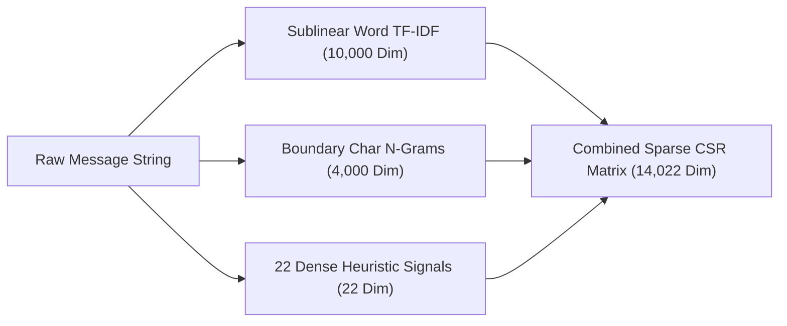
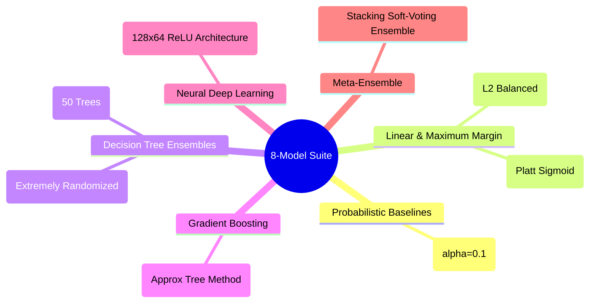
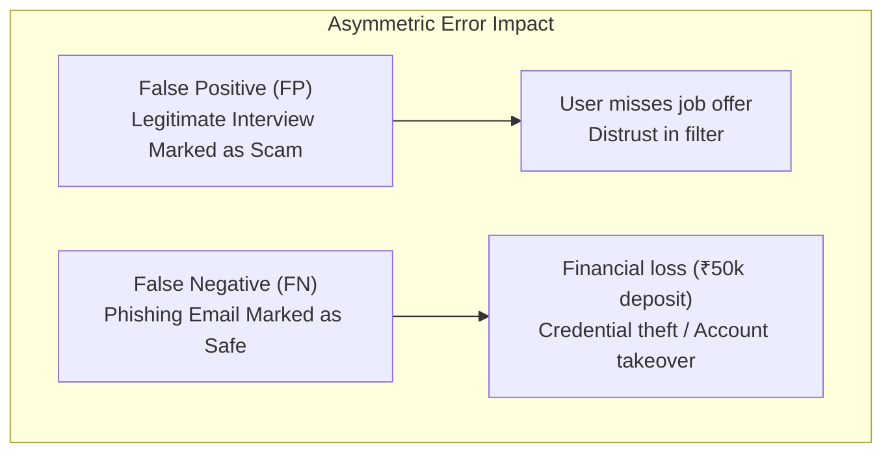
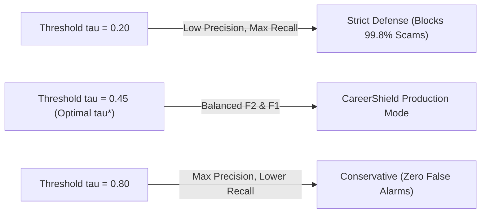

# 📐 04 · Machine Learning & NLP Theoretical Foundations
## Mathematical Formulations, Algorithmic Derivations, Calibration & Asymmetric Security Theory

---

## 1. Mathematical Foundations of Text Vectorization

Textual cybersecurity analysis requires transforming high-cardinality, unstructured email bodies into numerical feature representations that preserve semantic nuance while dampening malicious term flooding.

### 1.1. Sublinear Term Frequency-Inverse Document Frequency (TF-IDF)
Standard Term Frequency $TF(t, d)$ scales linearly with term count, making models vulnerable to keyword stuffing (e.g. an attacker repeating *"legitimate corporate interview"* 50 times). CareerShield ML applies **Sublinear TF scaling**:

$$TF_{\text{sublinear}}(t, d) = \begin{cases} 1 + \log(TF(t, d)) & \text{if } TF(t, d) > 0 \\ 0 & \text{otherwise} \end{cases}$$

Inverse Document Frequency is formulated with smoothed logarithmic attenuation:

$$IDF(t, D) = \log\left(\frac{1 + |D|}{1 + |\{d \in D : t \in d\}|}\right) + 1$$

The final feature weight is normalized via Euclidean ($L_2$) vector normalization:

$$\text{TF-IDF}(t, d, D) = \frac{TF_{\text{sublinear}}(t, d) \cdot IDF(t, D)}{\sqrt{\sum_{t' \in d} \left(TF_{\text{sublinear}}(t', d) \cdot IDF(t', D)\right)^2}}$$

### 1.2. Character N-Gram Boundary Modeling (`char_wb`)
Word-level tokenizers fail when encountering zero-width spaces, intentional typos, or homoglyph spoofing (e.g. *"amaz0n"*, *"micros0ft"*). CareerShield ML implements Character N-Grams constrained within word boundaries (`char_wb`) for $n \in [3, 4]$:

$$\vec{x}_{\text{char}} = \left[ \text{TF-IDF}(c_i, d) \right]_{i=1}^{4000}, \quad c_i \in \Sigma^3 \cup \Sigma^4$$

This ensures that sub-word tokens (like `"_ama"`, `"amaz"`, `"az0n"`, `"z0n_"`) trigger high similarity to known brand vectors regardless of lexical obfuscation.

---

## 2. Machine Learning Algorithmic Paradigms

### 2.1. Multinomial Naive Bayes with Laplace Smoothing
Naive Bayes computes the posterior class probability using conditional independence assumptions over the feature vector $\vec{x} = (x_1, \dots, x_M)$:

$$P(y = c \mid \vec{x}) \propto P(y = c) \prod_{j=1}^M P(x_j \mid y = c)^{x_j}$$

To prevent zero-probability collapse on unseen n-grams, Laplace smoothing with parameter $\alpha = 0.1$ is applied:

$$P(x_j \mid y = c) = \frac{\sum_{i \in \text{Class } c} x_{i, j} + \alpha}{\sum_{j'=1}^M \sum_{i \in \text{Class } c} x_{i, j'} + \alpha \cdot M}$$

In log-space, the decision boundary is linear:

$$\log \frac{P(y=1 \mid \vec{x})}{P(y=0 \mid \vec{x})} = \log \frac{P(y=1)}{P(y=0)} + \sum_{j=1}^M x_j \cdot \log \frac{P(x_j \mid y=1)}{P(x_j \mid y=0)}$$

---

### 2.2. Logistic Regression with Class-Weighted $L_2$ Regularization
Logistic Regression models the posterior probability via the logistic sigmoid function:

$$P(y = 1 \mid \vec{x}) = \sigma(\vec{w}^T \vec{x} + b) = \frac{1}{1 + \exp(-(\vec{w}^T \vec{x} + b))}$$

The parameter vector $\vec{w}$ is optimized by minimizing the balanced regularized negative log-likelihood:

$$\mathcal{L}(\vec{w}, b) = -\sum_{i=1}^N w_{y_i} \left[ y_i \log(\hat{p}_i) + (1 - y_i) \log(1 - \hat{p}_i) \right] + \frac{1}{2C} \|\vec{w}\|_2^2$$

Where class weights $w_c$ automatically adjust for any residual class imbalance:

$$w_c = \frac{N}{2 \cdot N_c}, \quad C = 2.0$$

---

### 2.3. Linear Support Vector Machine & Platt Sigmoid Calibration
Linear Support Vector Machines construct the optimal maximum-margin separating hyperplane by minimizing the soft-margin hinge loss:

$$\min_{\vec{w}, b, \vec{\xi}} \left( \frac{1}{2} \|\vec{w}\|_2^2 + C \sum_{i=1}^N \xi_i \right) \quad \text{s.t.} \quad y_i (\vec{w}^T \vec{x}_i + b) \ge 1 - \xi_i, \quad \xi_i \ge 0$$

#### Platt Probability Calibration
Because standard SVMs output uncalibrated geometric margins $f(\vec{x}) = \vec{w}^T \vec{x} + b$ rather than probabilities, CareerShield ML applies **Platt Sigmoid Calibration** using 3-fold cross-validation (`CalibratedClassifierCV(LinearSVC, cv=3)`):

$$P(y = 1 \mid f(\vec{x})) = \frac{1}{1 + \exp(A \cdot f(\vec{x}) + B)}$$

Parameters $A$ and $B$ are optimized via maximum likelihood on out-of-fold validation splits, ensuring that output scores reflect empirical posterior probabilities.

---

### 2.4. Gradient Tree Boosting (XGBoost)
XGBoost builds an additive ensemble of $K$ regression trees:

$$\hat{y}_i = \sum_{k=1}^K f_k(\vec{x}_i), \quad f_k \in \mathcal{F}$$

At step $t$, the objective function is approximated via second-order Taylor expansion:

$$\tilde{\mathcal{L}}^{(t)} \approx \sum_{i=1}^N \left[ g_i f_t(\vec{x}_i) + \frac{1}{2} h_i f_t^2(\vec{x}_i) \right] + \gamma T + \frac{1}{2} \lambda \sum_{j=1}^T w_j^2$$

Where first- and second-order gradients for logistic loss are:

$$g_i = \hat{p}_i - y_i, \quad h_i = \hat{p}_i (1 - \hat{p}_i)$$

For high-dimensional sparse NLP inputs (14,022 features), CareerShield ML configures `tree_method='approx'`, `colsample_bytree=0.2`, and `subsample=0.8` to prevent overfitting.

---

### 2.5. Deep Multi-Layer Perceptron (MLP) Neural Network
The deep learning component consists of a fully connected neural architecture with hidden layers $h_1 \in \mathbb{R}^{128}$ and $h_2 \in \mathbb{R}^{64}$:

$$h_1 = \text{ReLU}(W_1 \vec{x} + b_1), \quad W_1 \in \mathbb{R}^{128 \times 14022}$$
$$h_2 = \text{ReLU}(W_2 h_1 + b_2), \quad W_2 \in \mathbb{R}^{64 \times 128}$$
$$\hat{p} = \sigma(W_3 h_2 + b_3), \quad W_3 \in \mathbb{R}^{1 \times 64}$$

* **Activation Functions**: Rectified Linear Unit ($\text{ReLU}(z) = \max(0, z)$) for hidden layers $h_1$ and $h_2$; Logistic Sigmoid ($\sigma(z) = \frac{1}{1 + e^{-z}}$) for the binary output classification unit producing posterior probabilities in $[0, 1]$.
* **Optimization**: Adam optimizer with adaptive learning rates ($m_t, v_t$ bias-corrected first and second moments).
* **Regularization**: $L_2$ penalty $\alpha = 10^{-4}$ combined with automated early stopping monitoring a $10\%$ validation partition.

---

### 2.6. Stacking Meta-Ensemble (Soft-Voting Architecture)
The final production classifier aggregates calibrated posterior probability distributions across 5 diverse model families (Naive Bayes, Logistic Regression, Calibrated SVM, Random Forest, XGBoost):

$$P_{\text{ensemble}}(y = 1 \mid \vec{x}) = \frac{1}{K} \sum_{k=1}^K P_k(y = 1 \mid \vec{x})$$

$$\hat{y} = \mathbb{I}\left( P_{\text{ensemble}}(y = 1 \mid \vec{x}) \ge \tau^* \right)$$

Soft voting reduces prediction variance $\text{Var}(\bar{P}) \approx \frac{1}{K} \bar{\sigma}^2$ while preserving individual model sensitivity to distinct attack archetypes.

---

## 3. Asymmetric Cybersecurity Risk Theory & Metrics

In cybersecurity threat detection, errors have deeply asymmetric real-world consequences:

### 3.1. The $F_\beta$-Score Metric Family
While standard $F_1$-score treats precision and recall with equal weight ($\beta = 1$), security systems require tuning parameter $\beta$ according to operational posture:

$$F_\beta = (1 + \beta^2) \frac{\text{Precision} \cdot \text{Recall}}{\beta^2 \cdot \text{Precision} + \text{Recall}}$$

* **$F_2$-Score ($\beta = 2$) — Threat Hunting / Security Mode**:
  $$F_2 = 5 \cdot \frac{\text{Precision} \cdot \text{Recall}}{4 \cdot \text{Precision} + \text{Recall}}$$
  Weights Recall **4 times higher** than Precision. Catches elusive scams and credential harvesters where a False Negative causes catastrophic breach.
* **$F_{0.5}$-Score ($\beta = 0.5$) — High-Precision / Enterprise White-Glove Mode**:
  $$F_{0.5} = 1.25 \cdot \frac{\text{Precision} \cdot \text{Recall}}{0.25 \cdot \text{Precision} + \text{Recall}}$$
  Weights Precision **4 times higher** than Recall. Ensures zero critical executive correspondence is mistakenly quarantined.

---

### 3.2. PR-AUC vs. ROC-AUC in Threat Analysis
* **ROC-AUC**: Evaluates True Positive Rate ($TPR = \frac{TP}{TP + FN}$) against False Positive Rate ($FPR = \frac{FP}{FP + TN}$). In large corpora with dominant safe baselines, large $TN$ counts can artificially suppress $FPR$, presenting deceptively optimistic ROC curves.
* **PR-AUC (Average Precision)**: Evaluates Precision against Recall:
  $$\text{PR-AUC} = \sum_{n} (R_n - R_{n-1}) P_n$$
  PR-AUC explicitly tracks performance within the positive threat class, making it the **primary ground-truth metric** for model selection.

### 3.3. Brier Score Loss (Calibration Quality)
Measures the mean squared error between predicted risk probabilities $p_i \in [0, 1]$ and actual outcomes $y_i \in \{0, 1\}$:

$$BS = \frac{1}{N} \sum_{i=1}^N (p_i - y_i)^2, \quad BS \in [0, 1]$$

Lower Brier scores indicate well-calibrated probabilities suitable for user-facing risk percentages.

---

## 4. Decision Threshold Optimization ($\tau^*$)

Rather than defaulting to an unvalidated $\tau = 0.50$, optimal operating thresholds $\tau^*$ are swept across the validation set:

$$\tau^* = \arg\max_{\tau \in [0.05, 0.95]} F_2(\tau) \quad \text{subject to} \quad \text{Precision}(\tau) \ge 0.970$$

---

## 5. Bayesian Explainability & Evidence Decomposition

CareerShield ML deconstructs predictions into intuitive Bayesian log-odds:

### 5.1. Prior Log-Odds
From the training corpus prior probability $P(\text{Threat}) = 0.6044$:

$$\text{Log-Odds}_{\text{prior}} = \log\left(\frac{P(\text{Threat})}{1 - P(\text{Threat})}\right) = \log\left(\frac{0.6044}{0.3956}\right) = +0.4239$$

### 5.2. Evidence Score (Log-Likelihood Ratio)
Given model posterior calibrated probability $\hat{p} = P(\text{Threat} \mid \text{Text})$:

$$\text{Log-Odds}_{\text{posterior}} = \log\left(\frac{\hat{p}}{1 - \hat{p} + \epsilon}\right)$$

$$\text{Evidence Score} = \text{Log-Odds}_{\text{posterior}} - \text{Log-Odds}_{\text{prior}}$$

* An **Evidence Score $> +3.0$** indicates decisive textual evidence of threat (e.g. ₹89 ID fee trap, advance payment demands).
* An **Evidence Score $< -3.0$** indicates decisive evidence of authentic corporate hiring (e.g. verified ATS portal, official domain).
