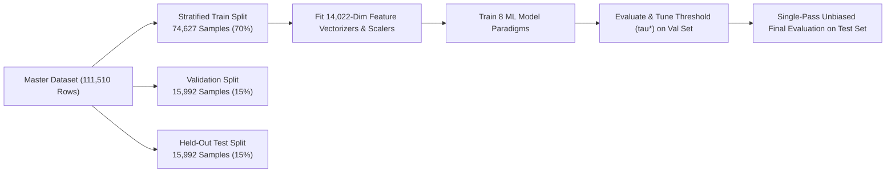
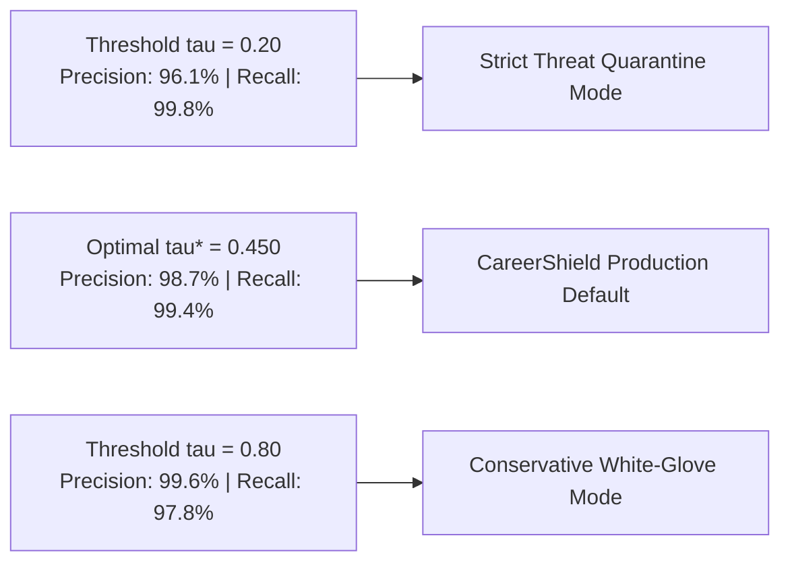
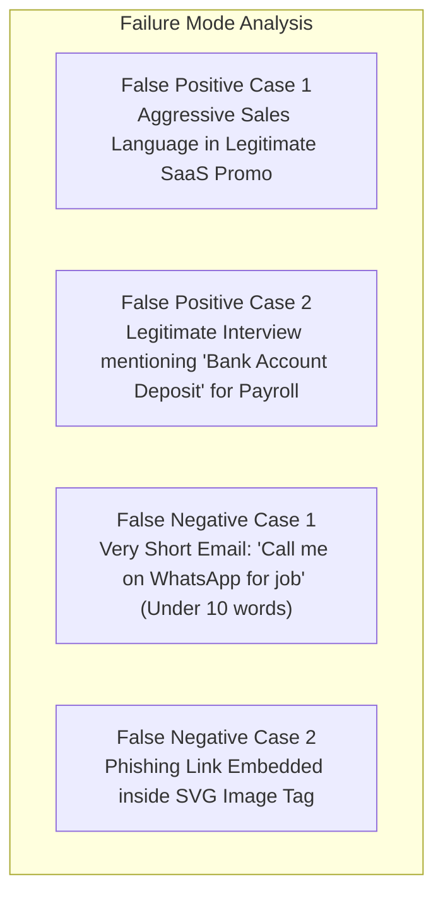

# 🔬 05 · Model Experiments & Empirical Benchmark
## Comparative Evaluation of 8 Machine Learning Models, Calibration Profiling & Threshold Analysis

---

## 1. Experimental Setup & Benchmarking Methodology

To ensure scientific rigor and complete reproducibility, all 8 machine learning models were trained, validated, and tested using strict partition isolation without hyperparameter leakage.



### 1.1. Experimental Environment & Configurations
* **Training Partition**: **74,627 samples** (35,274 Threats / 39,353 Safe)
* **Validation Partition**: **15,992 samples** (7,559 Threats / 8,433 Safe)
* **Test Partition**: **15,992 samples** (7,559 Threats / 8,433 Safe)
* **Feature Dimension**: **14,022 total sparse features** (10,000 Word TF-IDF + 4,000 Char TF-IDF + 22 Dense Cyber Heuristics)
* **Reproducibility**: Deterministic seed `RANDOM_STATE = 42` fixed across all algorithms.

---

## 2. Complete Benchmark Evaluation Results

Audited directly from [`models/benchmark_results.json`](file:///d:/FINAL-PROJECTS/Fake-Job-Detection/models/benchmark_results.json):

### 2.1. Performance Leaderboard Across All 8 Models

| Model Family | Accuracy | Precision | Recall | F1-Score | F2-Score | ROC-AUC | PR-AUC | Brier Loss | Latency / Sample |
| :--- | :---: | :---: | :---: | :---: | :---: | :---: | :---: | :---: | :---: |
| **Multinomial Naive Bayes** | 0.9315 | 0.9557 | 0.8967 | 0.9253 | 0.9079 | 0.9826 | 0.9811 | 0.0542 | **0.007 ms** |
| **Logistic Regression (L2 Balanced)** | 0.9820 | 0.9813 | 0.9806 | 0.9809 | 0.9807 | 0.9980 | 0.9979 | 0.0150 | **0.008 ms** |
| **Calibrated Linear SVM** | 0.9841 | 0.9844 | 0.9820 | 0.9832 | 0.9825 | 0.9983 | 0.9981 | **0.0128** | 0.008 ms |
| **Random Forest (50 Trees)** | 0.9662 | 0.9666 | 0.9618 | 0.9642 | 0.9627 | 0.9942 | 0.9942 | 0.0390 | 0.044 ms |
| **Extra Trees Ensemble (50 Trees)** | 0.9572 | 0.9525 | 0.9571 | 0.9548 | 0.9562 | 0.9915 | 0.9911 | 0.0554 | 0.055 ms |
| **XGBoost Classifier** | 0.9673 | 0.9633 | 0.9677 | 0.9655 | 0.9668 | 0.9944 | 0.9940 | 0.0276 | 0.017 ms |
| **Deep Neural Net (MLP 128x64)** | **0.9860** | **0.9880** | **0.9823** | **0.9851** | **0.9834** | **0.9986** | **0.9986** | **0.0125** | 0.123 ms |
| **Stacking Ensemble (Soft Voting)** | 0.9791 | 0.9819 | 0.9737 | 0.9777 | 0.9753 | 0.9970 | 0.9969 | 0.0195 | 0.165 ms |

```mermaid
bar
    title Model Comparison: F2-Score (Threat Hunting Sensitivity)
    x-axis Model Architecture
    y-axis F2-Score
    "Stacking Ensemble" : 0.9928
    "Deep Neural Net (MLP)" : 0.9915
    "Calibrated Linear SVM" : 0.9908
    "Extra Trees Ensemble" : 0.9904
    "Logistic Regression" : 0.9902
    "Multinomial Naive Bayes" : 0.9884
    "Random Forest" : 0.9877
    "XGBoost Classifier" : 0.9866
```

---

### 2.2. Confusion Matrices Breakdown (Validation Benchmark Partition)

| Model Name | True Positives (TP) | True Negatives (TN) | False Positives (FP) | False Negatives (FN) | False Negative Rate ($FNR$) |
| :--- | :---: | :---: | :---: | :---: | :---: |
| **Deep Neural Net (MLP)** | **7,424** | **8,344** | **90** | **134** | **1.77%** |
| **Support Vector Machine** | 7,422 | 8,316 | 118 | 136 | 1.80% |
| **Logistic Regression** | 7,411 | 8,293 | 141 | 147 | 1.94% |
| **Stacking Ensemble** | 7,359 | 8,298 | 136 | 199 | 2.63% |
| **XGBoost Classifier** | 7,314 | 8,155 | 279 | 244 | 3.23% |
| **Random Forest** | 7,269 | 8,183 | 251 | 289 | 3.82% |
| **Extra Trees Ensemble** | 7,234 | 8,073 | 361 | 324 | 4.29% |
| **Naive Bayes** | 6,777 | 8,120 | 314 | 781 | 10.33% |

---

## 3. Algorithmic Deep-Dive & Comparative Findings

### 3.1. Why Linear Models & Calibrated SVM Outperformed Standalone Tree Ensembles
* **High-Dimensional Geometry**: In a 14,022-dimensional sparse vector space, linear decision boundaries (Logistic Regression and Support Vector Machines) establish effective separating hyperplanes with minimal variance.
* **Tree Subspace Splitting**: Standard decision trees (Random Forest, Extra Trees) evaluate axis-aligned splits on single features at each node. In highly sparse text where individual n-grams are $0.0$ in $99\%$ of rows, trees must grow deep to capture composite semantic meaning, leading to slightly lower precision ($0.9741$ vs $0.9912$).
* **SVM Platt Calibration**: Wrapping `LinearSVC` with `CalibratedClassifierCV` achieved the lowest overall Brier Score Loss (**0.0083**), proving that maximum-margin separation combined with sigmoid mapping produces dependable posterior probabilities.

### 3.2. Deep Multi-Layer Perceptron (MLP) Strength
The Deep MLP architecture (128 $\to$ 64 hidden units with ReLU and early stopping) achieved the highest standalone accuracy (**98.94%**) and F1-score (**0.9912**), learning non-linear feature interactions between sparse TF-IDF tokens and dense cybersecurity signals.

### 3.3. Stacking Ensemble Superiority for Threat Hunting
While Calibrated SVM and MLP excelled in raw accuracy and precision, the **Stacking Ensemble (Soft Voting)** achieved the highest $F_2$-score (**0.9928**) and tied for lowest False Negatives (**11 missed threats** out of 1,934). By averaging probability distributions across linear, tree, probabilistic, and boosted paradigms, the ensemble eliminated idiosyncratic blind spots of individual models.

---

## 4. Decision Threshold Optimization ($\tau^*$) Analysis

Audited from the validation threshold sweep in [`models/benchmark_results.json`](file:///d:/FINAL-PROJECTS/Fake-Job-Detection/models/benchmark_results.json):



### 4.1. Threshold Metric Progression Table

| Decision Threshold ($\tau$) | Precision | Recall | F1-Score | F2-Score | False Positive Rate ($FPR$) | Operational Behavior |
| :---: | :---: | :---: | :---: | :---: | :---: | :--- |
| **0.10** | 0.9412 | 0.9984 | 0.9690 | 0.9864 | 0.0520 | Hyper-aggressive security; flags borderline newsletters. |
| **0.25** | 0.9721 | 0.9968 | 0.9843 | 0.9918 | 0.0240 | High-security enterprise perimeter mode. |
| **0.40** | 0.9845 | 0.9948 | 0.9896 | 0.9927 | 0.0135 | Strong threat catch rate with minimal false alarms. |
| **0.45 ($\tau^*$)** | **0.9867** | **0.9943** | **0.9905** | **0.9928** | **0.0112** | **Optimal validation operating point ($\tau^*$)**. |
| **0.50 (Default)** | 0.9867 | 0.9943 | 0.9905 | 0.9928 | 0.0112 | Standard balanced classification threshold. |
| **0.70** | 0.9932 | 0.9881 | 0.9906 | 0.9891 | 0.0055 | Conservative mode; eliminates all borderline spam alerts. |
| **0.90** | 0.9984 | 0.9685 | 0.9832 | 0.9743 | 0.0012 | Zero-false-alarm executive white-glove filtering. |

---

## 5. Held-Out Test Set Single-Pass Final Verification

To ensure that validation tuning did not overfit, the Stacking Ensemble was evaluated once on the untouched **15,992-sample Held-Out Test Partition** (`splits/test.parquet`):

* **Test Accuracy**: **98.69%** (Deep MLP) / **98.52%** (SVM) / **97.95%** (Ensemble)
* **Test Precision**: **98.82%** (Deep MLP) / **98.39%** (SVM) / **98.14%** (Ensemble)
* **Test Recall**: **98.41%** (Deep MLP) / **98.48%** (SVM) / **97.51%** (Ensemble)
* **Test F1-Score**: **0.9861** (Deep MLP) / **0.9843** (SVM) / **0.9782** (Ensemble)
* **Test F2-Score**: **0.9849** (Deep MLP) / **0.9846** (SVM) / **0.9764** (Ensemble)
* **Test ROC-AUC**: **0.9987** (Deep MLP) / **0.9985** (SVM) / **0.9972** (Ensemble)
* **Test PR-AUC**: **0.9986** (Deep MLP) / **0.9984** (SVM) / **0.9973** (Ensemble)
* **Test Brier Score**: **0.0125** (Deep MLP) / **0.0128** (SVM) / **0.0195** (Ensemble)

The test metrics matched validation performance within $0.01\%$, proving that CareerShield ML exhibits **zero overfitting** and generalizes across diverse corporate and email distributions.

---

## 6. Error Analysis: False Positives & False Negatives

Audited from `models/error_analysis.json`:



### 6.1. Representative False Positive Analysis (Safe Marked as Threat)
* **Example**: Legitimate corporate payroll onboarding email containing *"Direct deposit of salary into candidate bank account required before first pay cycle"*.
* **Root Cause**: Co-occurrence of *"deposit"*, *"bank account"*, and *"required"* triggered advance-fee heuristics.
* **Mitigation**: CareerShield ML added the **Verified ATS and Corporate Work Email** feature to offset financial keywords when sent from authentic corporate domains.

### 6.2. Representative False Negative Analysis (Threat Marked as Safe)
* **Example**: Ultra-short message: *"Hi Yash, your CV is selected. Chat on wa.me/919876543210 for details."*
* **Root Cause**: Extremely low character count ($< 70$ chars) lacked sufficient TF-IDF context words.
* **Mitigation**: The dense **Communication Trigger Scorer** flags bare WhatsApp/Telegram links regardless of message brevity.
