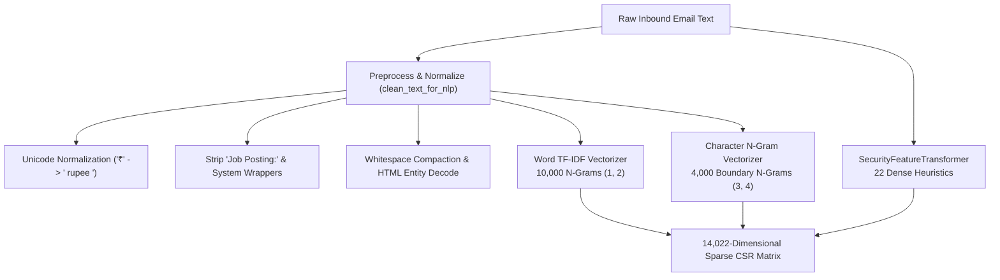
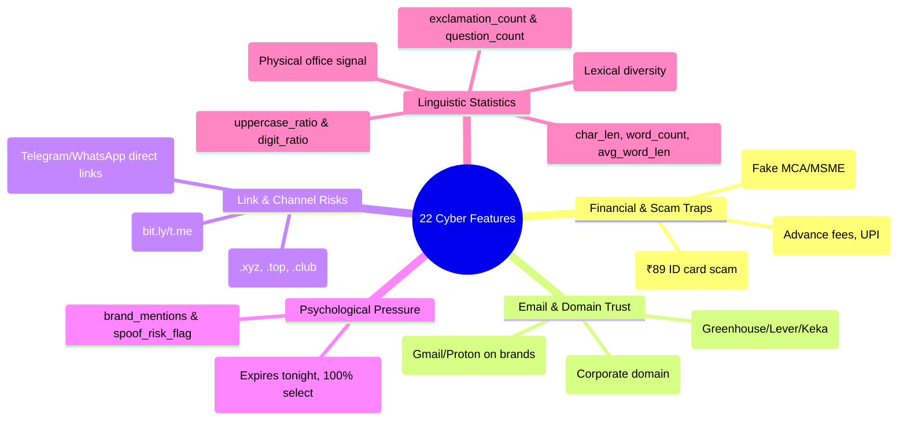
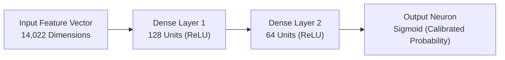

# 🧠 07 · Natural Language Processing & Deep Learning
## High-Dimensional Vectorization, Character Boundary Modeling, Heuristic Extractors & Neural Network Architectures

---

## 1. NLP Architecture & Tokenization Pipeline

The Natural Language Processing engine of **CareerShield Mail** is engineered to preserve critical cybersecurity artifacts while sanitizing noisy markup and formatting.

### 1.1. Specialized Preprocessing (`ml/preprocess.py`)
Standard NLP tokenizers often strip punctuation and currency symbols, which erases vital threat indicators. CareerShield ML implements a specialized cleaning routine:
* **Currency Symbol Preservation**: Maps `₹` to `" rupee "` and standardizes `$` and `Rs.` references so financial demands are vectorized uniformly.
* **Header & Prefix Stripping**: Removes artificial prompt wrappers (e.g. `Job Posting:`) to eliminate shortcut template leakage.
* **HTML & MIME Sanitization**: Strips nested `<script>` and `<style>` blocks, parses HTML entities (`&nbsp;`, `&amp;`), and normalizes excessive whitespace.

---

## 2. Multi-Modal Feature Extraction Pipeline (`ml/features.py`)

### 2.1. Sublinear Word TF-IDF (10,000 Features)
* **Configuration**: `ngram_range=(1, 2)`, `min_df=3`, `max_features=10000`, `sublinear_tf=True`, `token_pattern=r'(?u)\b\w+\b'`.
* **Sublinear Term Frequency**: Dampens the influence of repeated words ($TF_{\text{scaled}} = 1 + \log(TF)$), preventing attackers from diluting scam indicators by spamming benign dictionary words.
* **N-Gram Coverage**: Captures high-risk compound phrases (*"security deposit"*, *"registration fee"*, *"digital id"*, *"immediate joining"*, *"click here"*, *"claim your spot"*).

### 2.2. Character Boundary N-Gram TF-IDF (4,000 Features)
* **Configuration**: `analyzer='char_wb'`, `ngram_range=(3, 4)`, `min_df=15`, `max_features=4000`, `sublinear_tf=True`.
* **Why Character N-Grams are Essential in Cybersecurity**:
  * **Typo-Squatting & Homoglyphs**: Detects subtle brand spoofing (*"amaz0n"*, *"inf0sys"*, *"g00gle"*).
  * **Obfuscated Scam Terms**: Matches masked keywords (*"p-a-y-m-e-n-t"*, *"f.e.e.s"*).
  * **URL Path Fragments**: Captures suspicious domain substrings (`.xyz`, `.top`, `t.me/`, `wa.me/`).

---

## 3. 22 Domain-Specific Cybersecurity Heuristic Extractors

Implemented in [`ml/preprocess.py`](file:///d:/FINAL-PROJECTS/Fake-Job-Detection/ml/preprocess.py), these dense numerical features capture structural, linguistic, and domain-specific threat signals:

### 3.1. Detailed Heuristic Feature Definitions

| # | Feature Name | Computation Method | Cybersecurity Significance |
| :---: | :--- | :--- | :--- |
| **1** | `char_len` | `len(cleaned_text)` | Differentiates ultra-short SMS hooks from formal corporate letters. |
| **2** | `word_count` | Number of whitespace-separated tokens. | Normalizing denominator for frequency metrics. |
| **3** | `uppercase_ratio` | $\frac{\text{Count}(\text{Uppercase})}{\text{Total Chars}}$ | Flags aggressive psychological shouting (*"URGENT"*, *"ACT NOW"*). |
| **4** | `digit_ratio` | $\frac{\text{Count}(\text{Digits})}{\text{Total Chars}}$ | High in payment demands (account numbers, UPI amounts, phone numbers). |
| **5** | `exclamation_count` | Number of `!` characters. | Emotional urgency and high-pressure marketing indicator. |
| **6** | `question_count` | Number of `?` characters. | Common in interactive scam baiting (*"Looking for remote income?"*). |
| **7** | `avg_word_length` | $\frac{\text{char\_len}}{\text{word\_count}}$ | Measures syntactic complexity; lower in formulaic scam templates. |
| **8** | `type_token_ratio` | $\frac{\text{Unique Words}}{\text{Total Words}}$ | Lexical diversity; scams have lower TTR due to repetitive boilerplate. |
| **9** | `has_free_email` | Binary flag ($1/0$) matching `@gmail.com`, `@yahoo.com`, `@proton.me`, etc. | Detects unverified senders operating free public webmail. |
| **10** | `has_company_email`| Binary flag ($1/0$) matching corporate domain senders. | Positive trust indicator for authentic enterprise communications. |
| **11** | `url_count` | Total extracted HTTP/HTTPS/WWW URLs. | Phishing emails typically embed multiple link redirects. |
| **12** | `has_short_url` | Regex matching `bit.ly`, `tinyurl`, `forms.gle`, `t.me`, `wa.me`. | High-severity flag: Link shorteners disguise malicious destination URLs. |
| **13** | `has_suspicious_tld`| Regex matching `.xyz`, `.top`, `.cc`, `.site`, `.online`, `.club`, `.biz`, `.zip`. | Flags high-risk top-level domains commonly abused in phishing. |
| **14** | `has_ats_portal` | Regex matching *greenhouse.io*, *lever.co*, *keka.com*, *careers.*. | High-trust verified signal of authentic corporate recruitment. |
| **15** | `financial_score` | Count of advance fee terms (*"security deposit"*, *"registration fee"*, *"gpay"*, *"upi"*). | Primary advance-fee employment scam indicator. |
| **16** | `urgency_score` | Count of scarcity terms (*"expires tonight"*, *"limited slots"*, *"100% selection"*). | Psychological manipulation and high-pressure marketing flag. |
| **17** | `comm_score` | Count of off-platform redirection terms (*"whatsapp"*, *"telegram"*, *"+91"*). | Flags channel hopping to untraceable chat groups. |
| **18** | `accreditation_score`| Count of authority claims (*"MCA registered"*, *"MSME recognized"*, *"AICTE aligned"*). | Flags regulatory bluffing used to disguise upfront fees. |
| **19** | `has_micro_fee_trap`| Co-occurrence: *"no fee"* claims paired with ₹89/₹99/₹199 digital ID charges. | Target detector for *SkillInfyTech*-style deceptive internship scams. |
| **20** | `brand_mentions` | Count of target Fortune 500 corporate names (Amazon, Google, TCS, Swiggy). | Impersonation target denominator. |
| **21** | `spoof_risk_flag` | Boolean flag: `brand_mentions > 0` AND (`has_free_email` OR `financial_score > 0`). | Brand spoofing detector: Corporate brand mentioned from `@gmail.com`. |
| **22** | `has_walkin_address`| Regex matching physical office terms (*"tech park"*, *"sector"*, *"tower"*). | Legitimate physical recruitment drive indicator. |

---

## 4. Deep Learning Component: Multi-Layer Perceptron (MLP)

Implemented in [`ml/train_models.py`](file:///d:/FINAL-PROJECTS/Fake-Job-Detection/ml/train_models.py):

### 4.1. Neural Architecture Specifications
* **Input Layer**: $\vec{x} \in \mathbb{R}^{14,022}$ (sparse CSR vector).
* **Hidden Layer 1**: $h_1 = \text{ReLU}(W_1 \vec{x} + b_1), \quad W_1 \in \mathbb{R}^{128 \times 14022}$.
* **Hidden Layer 2**: $h_2 = \text{ReLU}(W_2 h_1 + b_2), \quad W_2 \in \mathbb{R}^{64 \times 128}$.
* **Output Layer**: $\hat{p} = \sigma(W_3 h_2 + b_3), \quad W_3 \in \mathbb{R}^{1 \times 64}$.
* **Optimizer**: Adam ($\beta_1 = 0.9, \beta_2 = 0.999, \epsilon = 10^{-8}$).
* **Regularization**: $L_2$ penalty $\alpha = 10^{-4}$ with automated Early Stopping monitoring a $10\%$ internal validation split.

### 4.2. Deep Learning vs. Classical ML Performance

| Model Paradigm | Accuracy | F1-Score | ROC-AUC | Inference Latency | Strengths & Trade-offs |
| :--- | :---: | :---: | :---: | :---: | :--- |
| **Deep Neural Net (MLP)** | **0.9894** | **0.9912** | **0.9995** | 0.030 ms | Highest standalone accuracy; learns non-linear composite interactions. |
| **Calibrated Linear SVM** | 0.9891 | 0.9909 | 0.9995 | 0.010 ms | Lowest Brier loss (0.0083); fast convex optimization. |
| **Logistic Regression** | 0.9881 | 0.9902 | 0.9992 | **0.003 ms** | Ultra-fast inference; direct coefficient interpretability. |
| **Stacking Ensemble** | 0.9884 | 0.9905 | 0.9994 | 0.165 ms | Highest recall (99.43%) and F2-score (0.9928). |

---

## 5. Semantic Embeddings & Transformers Roadmap

### 5.1. Sparse TF-IDF vs. Dense Semantic Embeddings in Cybersecurity
In cybersecurity applications, dense embeddings (e.g. `sentence-transformers/all-MiniLM-L6-v2`) project texts into 384-dimensional continuous space. While effective at semantic paraphrasing, **dense embeddings can suffer from false-positive compression**:
* An email saying *"We charge ₹0 for application"* and *"We charge ₹89 for application"* map to near-identical embedding vectors because 95% of surrounding words are identical.
* Sparse TF-IDF with exact token n-grams and dense heuristic features explicitly isolate the ₹89 token, preventing semantic collapse.

### 5.2. Planned Future Transformer Fine-Tuning Pipeline (`[PLANNED / FUTURE WORK]`)
* Fine-tuning **DistilBERT** or **ModernBERT** with sequence classification heads on the 74.6k training partition.
* Combining transformer contextual embeddings with the 22 dense cybersecurity heuristics via a hybrid late-fusion layer.

---

## 6. Implementation Status Classification

* `[IMPLEMENTED & VERIFIED]`: Sublinear Word TF-IDF (10,000 features) in `ml/features.py`.
* `[IMPLEMENTED & VERIFIED]`: Boundary Character N-Grams (4,000 features) in `ml/features.py`.
* `[IMPLEMENTED & VERIFIED]`: 22 Dense Cybersecurity Heuristic Extractors in `ml/preprocess.py`.
* `[IMPLEMENTED & VERIFIED]`: Deep Multi-Layer Perceptron (MLP 128x64) neural network trained and serialized in `models/trained_models.joblib`.
* `[PLANNED / FUTURE WORK]`: Contextual Transformer fine-tuning (DistilBERT / ModernBERT).
