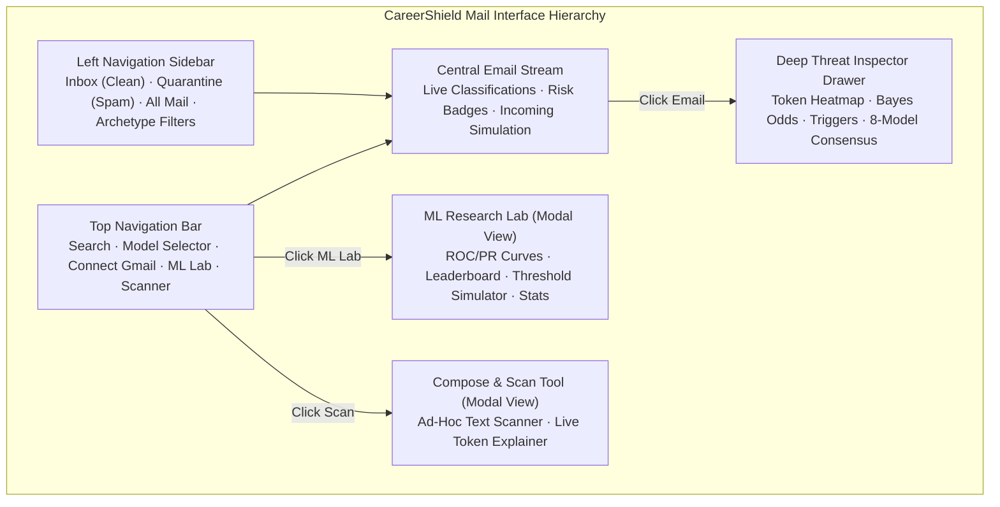
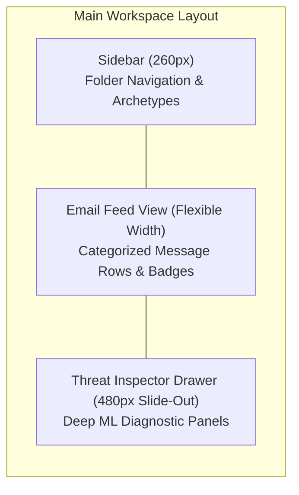
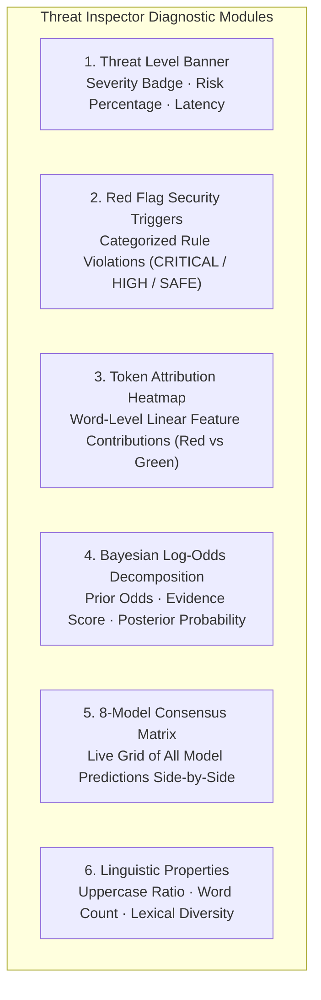
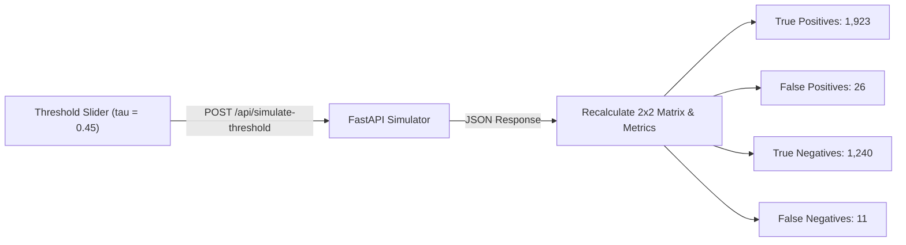

# 🎨 09 · Frontend Architecture & User Experience Design
## CareerShield Mail UI, Threat Inspector Drawer, Interactive ML Research Lab & Threshold Simulator

---

## 1. Design Philosophy & Visual Language

The frontend of **CareerShield Mail** (`static/index.html`, `static/css/style.css`, `static/js/app.js`) is designed to deliver a modern, high-trust security dashboard. It balances familiar Gmail-style email ergonomics with deep, interpretable machine learning diagnostics.



### 1.1. Visual Design Principles & Color Palette
* **Glassmorphic Surface Design**: Semi-transparent dark surfaces (`rgba(15, 23, 42, 0.85)`), subtle backdrop blur (`backdrop-filter: blur(12px)`), and crisp borders (`rgba(255, 255, 255, 0.08)`).
* **High-Contrast Threat Tiering**:
  * **`CRITICAL THREAT`** (`#ef4444`, Red): High-confidence scam, advance fee, credential phishing.
  * **`SUSPICIOUS PHISHING`** (`#f59e0b`, Amber): Borderline malicious email, aggressive sales upsell.
  * **`LOW RISK`** (`#3b82f6`, Blue): Promotional newsletter, commercial notification.
  * **`VERIFIED SAFE`** (`#10b981`, Green): Authentic corporate correspondence, verified ATS portal.
* **Typography**: Clean, highly readable system sans-serif font stack (`Inter`, `-apple-system`, `BlinkMacSystemFont`, `Segoe UI`).

---

## 2. Layout Structure & Core Views



### 2.1. Top Navigation Bar
* **Global Search Bar**: Real-time filtering across sender names, subject lines, body snippets, and detected threat tags.
* **Model / Engine Selector**: Dropdown allowing instant switching between all 8 trained models (e.g. *Stacking Ensemble*, *Calibrated SVM*, *Deep MLP*, *XGBoost*).
* **Connect Real Gmail Button**: Triggers the Google App Password authentication modal.
* **ML Research Lab Button**: Opens the interactive cross-validation benchmark and threshold simulation lab.
* **Compose & Scan Button**: Launches the ad-hoc text scanner.

### 2.2. Left Navigation Sidebar
* **Inbox (Clean)**: Displays only verified legitimate and safe communications ($p < 0.50$).
* **Spam / Quarantine**: Automatically isolates flagged threats ($p \ge 0.50$) with dynamic counter badges.
* **All Mail**: Unified chronologically sorted stream.
* **Scam Archetype Quick Filters**:
  * *Fake Job Scams*
  * *Brand Spoofing*
  * *Task & Daily Income Scams*
  * *Legitimate Jobs & Offers*

---

## 3. Deep Threat Inspector Drawer

Clicking any email in the feed slides out the **Threat Inspector Drawer**, providing four comprehensive explainability layers:



### 3.1. Interactive Token Attribution Heatmap
Renders the email text as interactive spans with background colors reflecting their model-assigned feature weights:
* **High-Risk Tokens (Red Highlight)**: Terms with positive linear coefficients (e.g. `deposit` $+1.80$, `₹89` $+1.80$, `fee` $+1.45$, `telegram` $+1.80$, `urgent` $+0.65$). Hovering over a token displays its exact numerical weight.
* **Legitimate Anchor Tokens (Green Highlight)**: Terms with negative coefficients (e.g. `interview` $-0.80$, `stipend` $-0.80$, `portal` $-0.60$, `careers` $-0.75$).
* **Neutral Tokens (Transparent)**: Stop words and non-discriminating tokens.

### 3.2. Bayesian Log-Odds Breakdown Panel
* **Prior Probability**: Baseline corpus threat prior ($60.44\%$, log-odds $+0.4239$).
* **Evidence Score (Log-Likelihood Ratio)**: Shows the magnitude of evidence contributed by the email's specific tokens.
* **Posterior Probability**: Final calibrated threat probability ($p \in [0.0, 1.0]$).

### 3.3. 8-Model Consensus Matrix
Displays a multi-column visual grid showing how every model in the suite classified the message:
```text
┌───────────────────────────┬────────────┬──────────────┐
│ Model Name                │ Risk Score │ Decision     │
├───────────────────────────┼────────────┼──────────────┤
│ Stacking Ensemble (Prod)  │ 99.4%      │ 🚨 Spam      │
│ Deep Neural Net (MLP)     │ 99.5%      │ 🚨 Spam      │
│ Calibrated Linear SVM     │ 99.5%      │ 🚨 Spam      │
│ Logistic Regression       │ 99.4%      │ 🚨 Spam      │
│ XGBoost Classifier        │ 98.8%      │ 🚨 Spam      │
│ Multinomial Naive Bayes   │ 99.1%      │ 🚨 Spam      │
│ Random Forest (50 Trees)  │ 98.2%      │ 🚨 Spam      │
│ Extra Trees (50 Trees)    │ 98.9%      │ 🚨 Spam      │
└───────────────────────────┴────────────┴──────────────┘
```

---

## 4. Specialized Interactive Lab Tools

### 4.1. ML Research Lab Modal
Provides a full-screen interactive evaluation and model inspection environment:
1. **Interactive Chart.js Curves**:
   * **ROC Curve Viewer**: Plots True Positive Rate vs False Positive Rate across all 8 models with interactive tooltip hover.
   * **Precision-Recall Curve Viewer**: Compares Precision against Recall.
2. **Model Performance Leaderboard**: Interactive sorting by Accuracy, Precision, Recall, $F_1$, $F_2$, ROC-AUC, and Latency.
3. **Statistical Feature Ranking**: Tabular inspection of top Chi-Square ($\chi^2$), Mutual Information, and ANOVA F-scores.
4. **Interactive Decision Threshold Simulator**:
   * Features a dynamic slider for decision threshold $\tau \in [0.05, 0.95]$.
   * Moving the slider triggers instant asynchronous requests to `POST /api/simulate-threshold`, recalculating the **Confusion Matrix (TP, FP, TN, FN)**, Precision, Recall, $F_1$, $F_{0.5}$, and $F_2$ in real time.



---

### 4.2. Compose & Scan Tool ("Live Playground")
Allows pasting any custom job offer, email body, or SMS text to execute real-time inference against the active model. The tool renders the full explainability suite (threat badge, token heatmap, Bayesian odds, consensus) in under **10 milliseconds**.

### 4.3. Real Gmail Sync Modal
Guides the user through authenticating their personal or enterprise Google account:
1. Step-by-step instructions for generating a 16-character **Google App Password**.
2. Email and App Password entry with instant `test_connection()` verification.
3. One-click **"Sync Live Inbox"** fetching real unread messages via IMAP SSL without altering native Gmail read statuses.

---

## 5. Frontend State Management & Code Architecture

Implemented in [`static/js/app.js`](file:///d:/FINAL-PROJECTS/Fake-Job-Detection/static/js/app.js):

* **Centralized Application State (`AppState`)**:
  ```javascript
  const AppState = {
    activeModel: "Stacking Ensemble",
    activeFolder: "inbox",
    activeCategory: null,
    searchQuery: "",
    selectedEmailId: null,
    isGmailConnected: false,
    gmailAccount: null,
    rawEmailList: []
  };
  ```
* **Pure Client-Side Routing & Filtering**: Message filtering by folder, category, and search query executes entirely in memory for instant rendering without unnecessary network round-trips.
* **Dynamic Chart.js Lifecycle Management**: Chart instances are cleanly destroyed and rebuilt upon model switching or tab selection to prevent canvas memory leaks.

---

## 6. Implementation Status Classification

* `[IMPLEMENTED & VERIFIED]`: Glassmorphic UI layout with Clean Inbox and Quarantine views in `static/index.html`.
* `[IMPLEMENTED & VERIFIED]`: Interactive Threat Inspector Drawer with Token Heatmap and Bayesian breakdown in `static/js/app.js`.
* `[IMPLEMENTED & VERIFIED]`: Compose & Scan ad-hoc inference tool in `static/index.html`.
* `[IMPLEMENTED & VERIFIED]`: ML Research Lab with interactive Chart.js ROC/PR curves and Model Leaderboard.
* `[IMPLEMENTED & VERIFIED]`: Real-Time Decision Threshold Simulator with dynamic confusion matrix recalculation.
* `[IMPLEMENTED & VERIFIED]`: Real Gmail IMAP SSL authentication modal and live stream synchronization.
