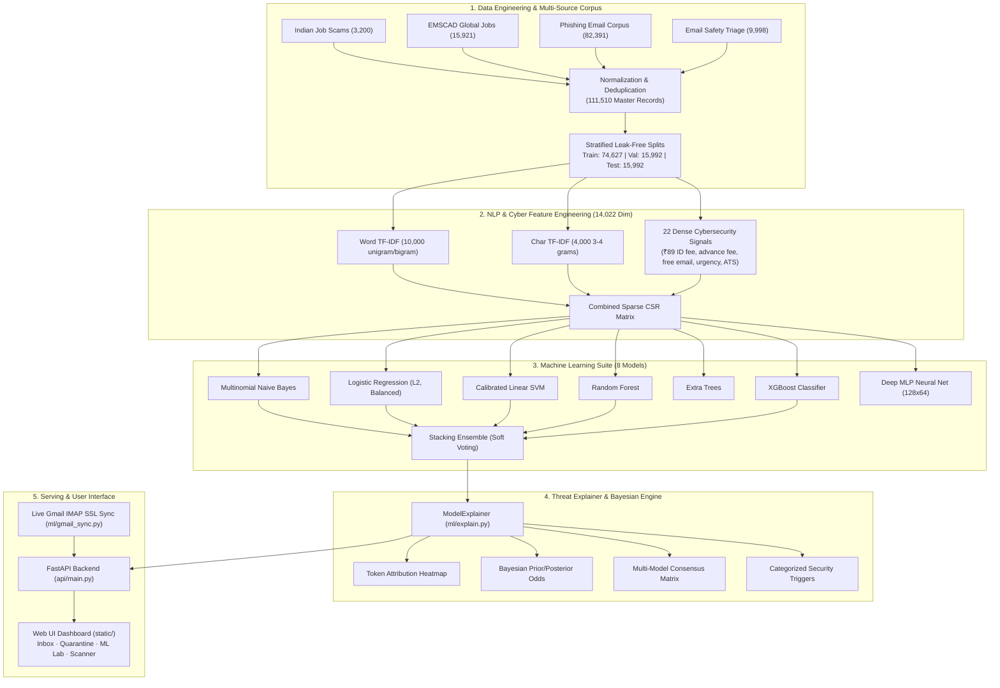

# 🛡️ CareerShield Mail — Complete Technical Documentation Suite
## Master Index & Documentation Map

**Project**: CareerShield Mail  
**Original / Internal Names**: Phishing & Malicious Message Detection System · Fake Job Detection  
**Repository Location**: `d:/FINAL-PROJECTS/Fake-Job-Detection`  
**Primary Domain**: Machine Learning · NLP · Cybersecurity Intelligence · Full-Stack Web Application  
**Target Goal**: Production-grade detection and explainability of job scams, internship fraud, advance-fee schemes, phishing attacks, and malicious message campaigns with live Gmail integration.

---

## 📚 Complete Document Map

This documentation suite captures the complete technical reality of the CareerShield Mail project, audited directly from the repository source code, datasets, serialized model artifacts, benchmark logs, and historical context.

| # | Document | File Path | Scope & Core Topics |
| :---: | :--- | :--- | :--- |
| **00** | **Documentation Index** | [`DOCUMENTATION_INDEX.md`](file:///d:/FINAL-PROJECTS/Fake-Job-Detection/docs/DOCUMENTATION_INDEX.md) | Navigation hub, system summary, document relationships, and quick links. |
| **01** | **Project Master Documentation** | [`01_PROJECT_MASTER_DOCUMENTATION.md`](file:///d:/FINAL-PROJECTS/Fake-Job-Detection/docs/01_PROJECT_MASTER_DOCUMENTATION.md) | High-level executive summary, problem domain, system architecture, core innovations, and verified status. |
| **02** | **Project History & Development Journey** | [`02_PROJECT_HISTORY_AND_DEVELOPMENT_JOURNEY.md`](file:///d:/FINAL-PROJECTS/Fake-Job-Detection/docs/02_PROJECT_HISTORY_AND_DEVELOPMENT_JOURNEY.md) | Evolution from narrow Fake Job Detection to multi-corpus email security, pivot points, failed experiments, and lessons learned. |
| **03** | **Datasets, Data Engineering & EDA** | [`03_DATASETS_DATA_ENGINEERING_AND_EDA.md`](file:///d:/FINAL-PROJECTS/Fake-Job-Detection/docs/03_DATASETS_DATA_ENGINEERING_AND_EDA.md) | 111,510 master records, 4 integrated sources, schemas, deduplication, leak-free stratified splits, and EDA statistics. |
| **04** | **ML & NLP Theory** | [`04_ML_NLP_THEORY.md`](file:///d:/FINAL-PROJECTS/Fake-Job-Detection/docs/04_ML_NLP_THEORY.md) | Mathematical and theoretical foundations: TF-IDF, Naive Bayes log-ratios, calibrated SVMs, decision trees, XGBoost, MLP, ROC/PR AUC, and Bayes rule. |
| **05** | **Model Experiments & Benchmark** | [`05_MODEL_EXPERIMENTS_AND_BENCHMARK.md`](file:///d:/FINAL-PROJECTS/Fake-Job-Detection/docs/05_MODEL_EXPERIMENTS_AND_BENCHMARK.md) | Comparative evaluation across 8 trained models, validation vs test partitions, confusion matrices, and threshold tuning ($\tau^*$). |
| **06** | **Final ML System** | [`06_FINAL_ML_SYSTEM.md`](file:///d:/FINAL-PROJECTS/Fake-Job-Detection/docs/06_FINAL_ML_SYSTEM.md) | Production feature pipeline (14,022 features), Stacking Ensemble architecture, inference engine, and error analysis. |
| **07** | **NLP & Deep Learning** | [`07_NLP_AND_DEEP_LEARNING.md`](file:///d:/FINAL-PROJECTS/Fake-Job-Detection/docs/07_NLP_AND_DEEP_LEARNING.md) | Sublinear Word TF-IDF, Char n-grams, 22 cybersecurity heuristics, MLP neural net implementation, embeddings, and Transformer/BERT roadmap. |
| **08** | **Software Architecture & Gmail API** | [`08_SOFTWARE_ARCHITECTURE_GMAIL_API.md`](file:///d:/FINAL-PROJECTS/Fake-Job-Detection/docs/08_SOFTWARE_ARCHITECTURE_GMAIL_API.md) | FastAPI backend design, REST endpoints, real-time IMAP SSL Gmail sync, thread-safe message processing, and security boundaries. |
| **09** | **Frontend & User Experience** | [`09_FRONTEND_AND_USER_EXPERIENCE.md`](file:///d:/FINAL-PROJECTS/Fake-Job-Detection/docs/09_FRONTEND_AND_USER_EXPERIENCE.md) | Web UI design system, Clean Inbox, Spam/Quarantine routing, Compose & Scan with token heatmap, ML Research Lab, and Threshold Simulator. |
| **10** | **Testing, Deployment & Security** | [`10_TESTING_DEPLOYMENT_SECURITY.md`](file:///d:/FINAL-PROJECTS/Fake-Job-Detection/docs/10_TESTING_DEPLOYMENT_SECURITY.md) | Test suites, archetype verification, production deployment guides, OAuth security, prompt-injection defense, and operational risks. |
| **11** | **Project Interview Bible** | [`11_PROJECT_INTERVIEW_BIBLE.md`](file:///d:/FINAL-PROJECTS/Fake-Job-Detection/docs/11_PROJECT_INTERVIEW_BIBLE.md) | Exhaustive Q&A guide (30s, 1min, 2min pitches, technical deep dives, follow-up defenses, and mathematical justifications). |
| **12** | **Project Glossary** | [`12_PROJECT_GLOSSARY.md`](file:///d:/FINAL-PROJECTS/Fake-Job-Detection/docs/12_PROJECT_GLOSSARY.md) | Comprehensive glossary of cybersecurity, NLP, machine learning, and system engineering terms used across the codebase. |
| **13** | **Documentation & Repository Audit** | [`DOCUMENTATION_AUDIT.md`](file:///d:/FINAL-PROJECTS/Fake-Job-Detection/docs/DOCUMENTATION_AUDIT.md) | Cross-document consistency audit, verified implementation vs planned status, file audit, and recommended next steps. |

---

## 🏛️ High-Level System Architecture



---

## 🚦 Verified Status Classification Legend

Throughout every document in this suite, every major capability, model, dataset, and feature is explicitly classified using this standardized schema:

* `[IMPLEMENTED & VERIFIED]`: Fully written in code, tested, executed, and artifact verified in the repository.
* `[PARTIALLY IMPLEMENTED]`: Code structure or backend exists, but secondary capabilities or edge cases remain in development.
* `[EXPERIMENTAL]`: Functional prototype built to evaluate an approach (e.g. decision threshold simulation).
* `[PLANNED]`: Identified in design roadmaps or history documents, but not yet present in repository code.
* `[FAILED / ABANDONED]`: Explored during early iterations and discarded with documented rationale (e.g. training on LLM assistant outputs).
* `[FUTURE WORK]`: Strategic extensions planned for production-scale deployment (e.g. OAuth 2.0 PKCE, Transformer fine-tuning).

---

## ⚡ Quick Start for Developers

```bash
# 1. Run the Web Application & Live Dashboard
python run.py
# -> Open http://localhost:8080

# 2. Run Archetype Verification Test Suite
python test_detection.py

# 3. Retrain Full Multi-Model Suite (8 Models)
python ml/train_models.py

# 4. Regenerate Master Dataset Splits
python data/create_splits.py
```
