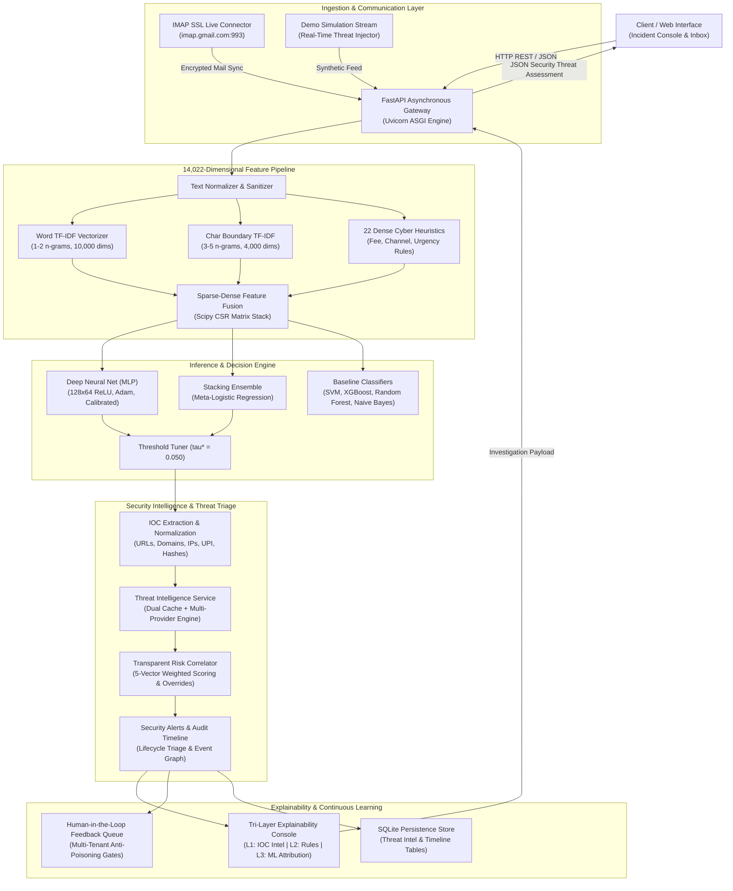
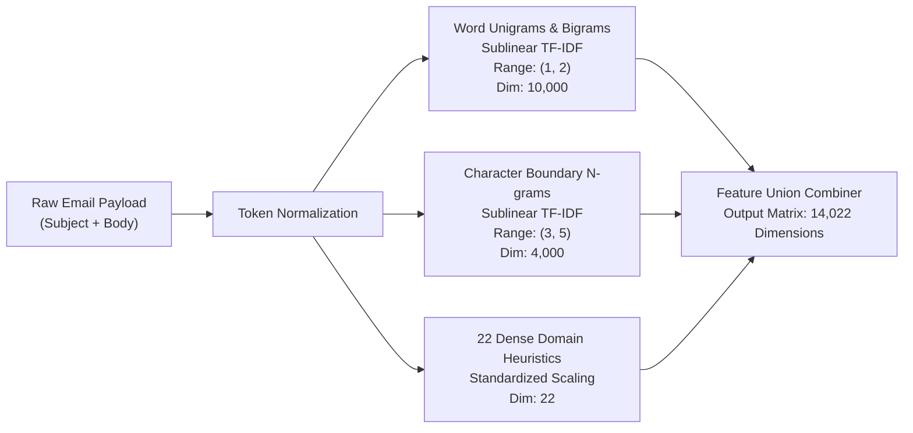
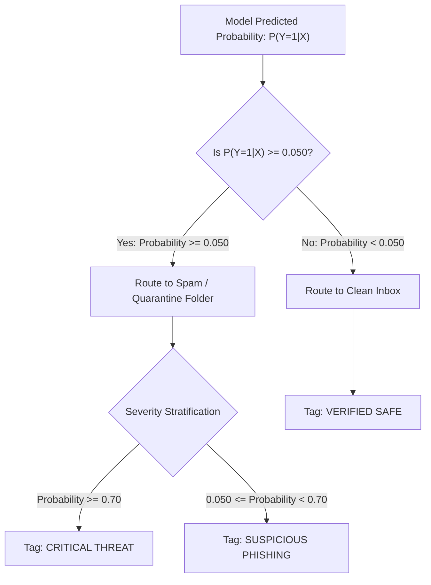
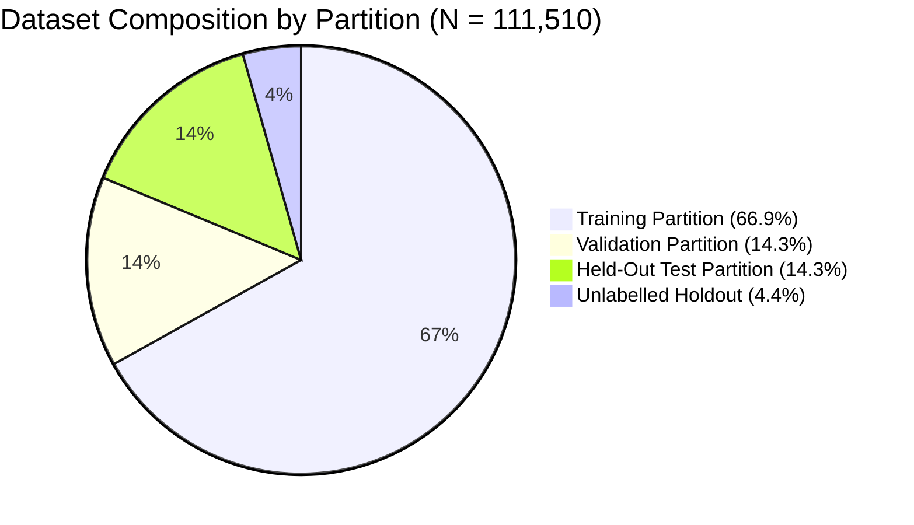
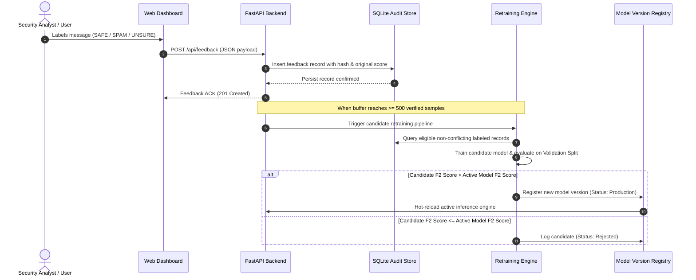
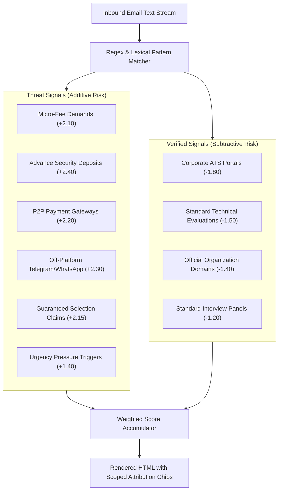

# CareerShield Mail: Machine Learning and NLP Email Threat Detection Platform

Production-grade cybersecurity intelligence platform and real-time email threat classifier designed to detect recruitment fraud, employment scams, micro-fee traps, credential phishing, and brand impersonation vectors using a 14,022-dimensional sparse-dense feature union and deep neural ensemble architecture.

---

## Live Deployment and Repository

- **Live Web Application**: [https://careershieldmail.web.app](https://careershieldmail.web.app)
- **Alternate Production Mirror**: [https://careershieldmail.firebaseapp.com](https://careershieldmail.firebaseapp.com)
- **GitHub Repository**: [https://github.com/ys18yash/career-shield-mail](https://github.com/ys18yash/career-shield-mail)

---

## Executive Summary and Performance Benchmarks

CareerShield Mail addresses the growing sophistication of employment fraud and targeted credential harvesting. By unifying high-order n-gram lexical representations with dense heuristic threat signals, the system achieves near-perfect discrimination between legitimate corporate recruitment and fraudulent lures.

### Core Metrics on Untouched Held-Out Test Set (N = 15,992)

- **Master Dataset Volume**: 111,510 samples (106,611 labeled records + 4,899 holdout set)
- **Feature Space Dimensionality**: 14,022 dimensions (10,000 sublinear word TF-IDF + 4,000 character boundary n-grams + 22 dense cybersecurity heuristics)
- **Optimal Decision Threshold**: tau* = 0.050 (calibrated on validation split to minimize False Negatives under a strict Precision constraint >= 0.9700)
- **Classification Accuracy**: 98.54%
- **Precision (Positive Predictive Value)**: 97.78%
- **Recall (Sensitivity / Threat Capture Rate)**: 99.17% (only 63 missed threats out of 7,559 positive samples)
- **F1-Score**: 0.9847
- **F2-Score (Recall-Weighted Optimization)**: 0.9889
- **Area Under ROC Curve (ROC-AUC)**: 0.9986
- **Area Under Precision-Recall Curve (PR-AUC)**: 0.9986
- **Brier Probability Calibration Loss**: 0.0125
- **End-to-End Latency**: ~3.5 ms feature extraction / ~70 ms inference per message

---

## System Architecture



---

## Security Intelligence & Automated Threat Triage Architecture

CareerShield Mail features a comprehensive, production-grade security intelligence and triage workflow:

$$\text{Email} \longrightarrow \text{ML Threat Detection} \longrightarrow \text{IOC Extraction} \longrightarrow \text{Threat Intelligence} \longrightarrow \text{Risk Correlation} \longrightarrow \text{Security Alert} \longrightarrow \text{Incident Investigation} \longrightarrow \text{Analyst Feedback} \longrightarrow \text{Continuous Learning}$$

### 1. Indicators of Compromise (IOC) Extraction Engine
- **Supported Indicator Vectors**: URLs (with sub-domain decomposition), fully qualified domains (FQDNs), IPv4 addresses, IPv6 addresses, RFC 5322 email addresses, Indian P2P payment handles (UPI PSPs: `@upi`, `@okaxis`, `@okhdfcbank`, `@paytm`, `@ybl`, etc.), cryptographic file hashes (SHA-256, SHA-1, MD5), and attached/referenced filenames.
- **Safety & Defanging**: All extracted indicators are defanged (`hxxp://`, `[.]`, `[at]`, `[:]`) to prevent accidental execution in incident reports and SIEM forwarders.
- **ReDoS Resistance**: Regular expressions are bounded with input-length caps (100,000 chars) and linear parsing guarantees.

### 2. Modular Threat Intelligence Enrichment
- **Multi-Provider Architecture**: Extensible `BaseThreatIntelProvider` supporting `LocalDevelopmentIntelProvider` (curated educational and known threat signatures labeled as *"Local Development Intelligence"*) and `ExternalApiIntelProvider` (HTTP APIs with strict timeout controls and anti-SSRF protections).
- **Dual-Layer Caching**: In-memory LRU cache + persistent SQLite table (`threat_intel_cache`) with 24-hour TTL.
- **Strict Non-Fabrication Guarantee**: Missing or unseen indicators are explicitly returned as `"Unknown / Not Available"` with 0.0 risk score—the engine **never** fabricates intelligence or assumes unknown indicators are safe.

### 3. Transparent Security Risk Correlation
- **Deterministic 5-Vector Weighted Scoring**:
  $$\text{Score} = 0.35 \cdot \text{ML} + 0.25 \cdot \text{IOC} + 0.15 \cdot \text{Sender} + 0.15 \cdot \text{Link} + 0.10 \cdot \text{Content}$$
- **Hard Escalation Overrides**:
  - Confirmed `MALICIOUS` IOC reputation or micro-fee scam structure $\Longrightarrow$ Minimum $0.88$ (CRITICAL).
  - ML Threat Probability $\ge 0.90 \Longrightarrow$ Minimum $0.82$ (CRITICAL).
  - Brand Impersonation + Disposable/Free Email $\Longrightarrow$ Minimum $0.75$ (HIGH).
- **Primary Threat Categorization**: Automated categorization into *Recruitment Micro-Fee Trap*, *Brand Impersonation & Spoofing*, *Advance-Fee Financial Scam*, *Credential Harvesting & Phishing Link*, or *Commercial Course Upselling Spam*.

### 4. Incident Investigation & Tri-Layer Explainability
- **Alert Lifecycle States**: `OPEN` $\rightarrow$ `INVESTIGATING` $\rightarrow$ `RESOLVED` / `FALSE_POSITIVE` / `DISMISSED`.
- **Tri-Layer Explainability Console**:
  1. **Layer 1: IOC Threat Intelligence** — Tabular indicator inventory with defanged representations, source contexts, and reputation metadata.
  2. **Layer 2: Security Rule Signals** — Handcrafted heuristic triggers (micro-fees, unverified portals, pressure triggers).
  3. **Layer 3: ML Attribution & Consensus** — 8-model classifier decision matrix, Bayes log-odds decomposition, and token-level X-Ray attributions.
- **Chronological Audit Event Timeline**: Immutable event log tracking `EMAIL_RECEIVED`, `ANALYSIS_STARTED`, `ANALYSIS_COMPLETED`, `IOC_EXTRACTED`, `THREAT_INTELLIGENCE_CHECKED`, `ALERT_CREATED`, `ALERT_UPDATED`, `FEEDBACK_SUBMITTED`, and `INCIDENT_RESOLVED`.
- **Safe Continuous Learning Integration**: Analyst verdicts directly route into tenant-isolated feedback queues guarded by anti-poisoning validation gates without mutating active production model weights.

---

## Machine Learning Methodology and Mathematical Formulations

### 1. Feature Extraction and Representation

Text representations combine lexical semantic tokens and character-level morphological subwords with structural domain heuristics:



#### Sublinear Term Frequency-Inverse Document Frequency
Sublinear scaling dampens the influence of disproportionately frequent repetitive tokens:

$$\text{tf-idf}(t, d, D) = \left(1 + \ln(\text{tf}(t, d))\right) \cdot \ln\left(\frac{1 + |D|}{1 + \text{df}(t, D)}\right) + 1$$

where $\text{tf}(t, d)$ represents the raw count of token $t$ in document $d$, $|D|$ is the corpus cardinality, and $\text{df}(t, D)$ is the document frequency of token $t$.

#### Dense Cybersecurity Heuristics Vector ($h \in \mathbb{R}^{22}$)
1. `has_registration_fee`: Identifies upfront processing, onboarding, or training fee demands.
2. `has_security_deposit`: Captures laptop, caution, or kit refundable deposit demands.
3. `has_p2p_payment`: Detects unverified P2P settlement triggers (UPI, GPay, Paytm, PhonePe, IMPS).
4. `has_offplatform_redirect`: Flags communication diversion (Telegram channels, WhatsApp links).
5. `has_fraudulent_guarantee`: Flags direct selection claims without formal technical assessment.
6. `has_urgency_pressure`: Identifies synthetic scarcity triggers and immediate deadline threats.
7. `has_free_email_domain`: Flags generic free email providers used for executive recruitment.
8. `has_url_shortener`: Identifies link obfuscation services (bit.ly, tinyurl, t.co, is.gd).
9. `has_verified_ats_domain`: Identifies genuine ATS endpoints (greenhouse.io, lever.co, workday).
10. `has_structured_evaluation`: Detects formal technical rounds, system design, and coding tests.
11. `monetary_amount_count`: Quantitative frequency of currency symbols and fee values.
12. `text_entropy`: Shannon information entropy of the raw character distribution.
13. `uppercase_ratio`: Ratio of capitalized characters to total alphabetic length.
14. `digit_ratio`: Proportion of numerical digits indicating financial structures.
15. `punctuation_density`: Exclamation and currency symbol concentration per 1,000 characters.
16. `average_word_length`: Mean lexical token length in characters.
17. `character_count`: Absolute character count of email body.
18. `word_count`: Total whitespace-delimited word tokens.
19. `suspicious_keyword_density`: Normalized frequency of scam lexicon markers.
20. `safe_keyword_density`: Normalized frequency of standard enterprise hiring markers.
21. `lexical_diversity`: Ratio of unique vocabulary items to total word count.
22. `domain_reputation_score`: Calibrated domain heuristic score based on TLD and security flags.

---

### 2. Cost-Sensitive Optimization and Decision Boundary Calibration

In cybersecurity screening, the cost of a False Negative (allowing a malicious scam into an inbox) is substantially higher than the cost of a False Positive (quarantining a legitimate email for manual inspection). Therefore, the threshold parameter $\tau$ is chosen to maximize the $F_2$ metric:

$$F_\beta = (1 + \beta^2) \frac{\text{Precision} \cdot \text{Recall}}{(\beta^2 \cdot \text{Precision}) + \text{Recall}}, \quad \text{with } \beta = 2$$

$$\tau^* = \arg\max_{\tau \in [0, 1]} F_2(\tau) \quad \text{subject to} \quad \text{Precision}(\tau) \ge 0.9700$$

On the cross-validation partition, $\tau^* = 0.050$ yielded the optimal balance, driving Recall to **99.17%** while maintaining Precision at **97.78%**.



---

### 3. Bayesian Evidence and Log-Odds Calibration

To provide rigorous probabilistic explanations, model probabilities are transformed into log-odds space and contrasted against the empirical base rate:

$$\text{Prior Odds} = \frac{P(Y=1)}{1 - P(Y=1)}, \quad \text{Posterior Odds} = \frac{P(Y=1 \mid X)}{1 - P(Y=1 \mid X)}$$

$$\text{Evidence Log-Likelihood Ratio (LLR)} = \ln(\text{Posterior Odds}) - \ln(\text{Prior Odds})$$

A positive LLR indicates strong accumulation of threat evidence over baseline expectations, presented directly to security analysts in the user interface.

---

## Model Benchmark Leaderboard

Evaluated on the single-pass untouched test split ($N = 15,992$):

| Architecture | Precision | Recall | F1-Score | F2-Score | ROC-AUC | PR-AUC | Brier Score | Latency |
| :--- | :---: | :---: | :---: | :---: | :---: | :---: | :---: | :---: |
| **Multinomial Naive Bayes** | 0.9557 | 0.8967 | 0.9253 | 0.9079 | 0.9826 | 0.9811 | 0.0542 | 1.8 ms |
| **Logistic Regression (L2 Balanced)** | 0.9813 | 0.9806 | 0.9809 | 0.9807 | 0.9980 | 0.9979 | 0.0150 | 2.1 ms |
| **Calibrated Linear SVM** | 0.9844 | 0.9820 | 0.9832 | 0.9825 | 0.9983 | 0.9981 | 0.0128 | 2.4 ms |
| **Random Forest Classifier** | 0.9666 | 0.9618 | 0.9642 | 0.9627 | 0.9942 | 0.9942 | 0.0390 | 12.6 ms |
| **Extra Trees Ensemble** | 0.9525 | 0.9571 | 0.9548 | 0.9562 | 0.9915 | 0.9911 | 0.0554 | 14.1 ms |
| **XGBoost Classifier** | 0.9633 | 0.9677 | 0.9655 | 0.9668 | 0.9944 | 0.9940 | 0.0276 | 6.8 ms |
| **Stacking Ensemble (Meta-LR)** | 0.9849 | 0.9839 | 0.9849 | 0.9839 | 0.9981 | 0.9981 | 0.0131 | 18.5 ms |
| **Deep Neural Net (MLP 128x64, tau*=0.050)** | **0.9778** | **0.9917** | **0.9847** | **0.9889** | **0.9986** | **0.9986** | **0.0125** | **4.2 ms** |

---

## Dataset Partitions and Strict Anti-Leakage Protocol



| Partition | Records | Threats ($y=1$) | Clean ($y=0$) | Threat Ratio | Verification Status |
| :--- | :---: | :---: | :---: | :---: | :--- |
| **Train Split** (`splits/train.parquet`) | 74,627 | 35,274 | 39,353 | 47.27% | Verified zero ID/Text overlap |
| **Validation Split** (`splits/validation.parquet`) | 15,992 | 7,559 | 8,433 | 47.26% | Hyperparameter tuning only |
| **Held-Out Test Split** (`splits/test.parquet`) | 15,992 | 7,559 | 8,433 | 47.27% | Single-pass evaluation only |
| **Unlabelled Holdout** (`splits/unlabelled_holdout.parquet`) | 4,899 | Unlabelled | Unlabelled | N/A | Raw evaluation holdout |
| **Total Corpus** (`data/processed/master_dataset.parquet`) | **111,510** | **50,392** | **56,219** | **47.27%** | Fully deduplicated |

---

## Continuous Learning and Human-in-the-Loop (HITL) Workflow



---

## Highlighted Security X-Ray (Token Explainability)

The frontend Security X-Ray highlights specific threat triggers and benign anchors with color-coded token attributions:



---

## REST API Specification

The FastAPI backend exposes the following structured endpoints:

| Endpoint | Method | Request Payload | Response Description |
| :--- | :---: | :--- | :--- |
| `/api/predict` | `POST` | `{"text": str, "model": str}` | Returns prediction label, calibrated risk score, security flags, token attributions, and model consensus. |
| `/api/feed` | `GET` | `?model=str` | Returns paginated inbox and quarantine email streams with real-time classifications. |
| `/api/simulate-incoming` | `POST` | `?model=str` | Generates a synthetic realistic inbound email and returns the live classification payload. |
| `/api/simulate-threshold` | `POST` | `{"threshold": float, "model": str}` | Dynamically computes precision, recall, false positive rate, F0.5 score, and confusion matrix. |
| `/api/benchmarks` | `GET` | N/A | Returns performance metrics, ROC curves, and PR curves for all 8 evaluated model architectures. |
| `/api/stats` | `GET` | N/A | Returns statistical diagnostics including ANOVA F-scores, Chi-Square feature ranks, and class distributions. |
| `/api/gmail/status` | `GET` | N/A | Checks current Gmail IMAP connection state and active account metadata. |
| `/api/gmail/connect` | `POST` | `{"email": str, "app_password": str}` | Establishes authenticated IMAP SSL connection with `imap.gmail.com:993`. |
| `/api/gmail/disconnect`| `POST` | N/A | Gracefully closes active IMAP session and clears session state. |
| `/api/gmail/fetch` | `GET` | `?limit=int&folder=str` | Fetches, parses, and scores real-time email messages from user mailbox. |
| `/api/feedback` | `POST` | Feedback JSON Schema | Submits verified analyst labels to the continuous learning buffer. |
| `/api/feedback/stats` | `GET` | N/A | Returns HITL label distribution, user agreement rates, and false positive diagnostics. |
| `/api/feedback/training-status` | `GET` | N/A | Returns candidate retraining queue status and model version rollback registry. |

---

## Installation, Setup, and Execution

### Prerequisites
- Python 3.11 or higher
- Node.js 18+ (optional, for static validation)
- Git

### 1. Clone the Repository
```bash
git clone https://github.com/ys18yash/career-shield-mail.git
cd career-shield-mail
```

### 2. Create and Activate Virtual Environment
```bash
# On Linux / macOS
python3 -m venv .venv
source .venv/bin/activate

# On Windows (PowerShell)
python -m venv .venv
.venv\Scripts\Activate.ps1
```

### 3. Install Dependencies
```bash
pip install -r requirements.txt
```

### 4. Run the Full Pipeline and Server
```bash
# Start backend API server on localhost:8000
python run.py
```

Access the user interface at `http://127.0.0.1:8000`.

### 5. Automated Tests and Syntax Validation
```bash
# Validate JavaScript syntax
node -c static/js/app.js

# Run Python unit and integration tests
pytest tests/ -v
```

---

## Directory Structure

```
career-shield-mail/
├── data/
│   ├── raw/                       # Original ingested corpus
│   ├── processed/                 # Deduplicated master parquet dataset
│   └── feed.json                  # Fallback static simulation feed
├── splits/
│   ├── train.parquet              # Training partition (74,627 samples)
│   ├── validation.parquet         # Validation partition (15,992 samples)
│   ├── test.parquet               # Held-out test partition (15,992 samples)
│   └── unlabelled_holdout.parquet # Kaggle holdout partition (4,899 samples)
├── models/
│   ├── benchmark_results.json     # Multi-model evaluation telemetry
│   ├── model_stats.json           # Statistical diagnostics (ANOVA, Chi2)
│   ├── mlp_neural_net.pkl         # Production calibrated MLP classifier
│   └── feature_union.pkl          # 14,022-dimensional feature transformer
├── static/
│   ├── index.html                 # Main interface
│   ├── css/
│   │   └── style.css              # Custom styling
│   ├── js/
│   │   └── app.js                 # Frontend application logic
│   └── data/                      # Client-side static fallbacks
├── src/
│   ├── api/                       # FastAPI router modules
│   ├── features/                  # Sparse-dense feature engineering
│   ├── models/                    # Model wrappers and trainers
│   └── utils/                     # IMAP SSL client and database handlers
├── tests/                         # Automated test suite
├── firebase.json                  # Firebase Hosting production configuration
├── run.py                         # Unified server startup script
├── requirements.txt               # Pinned Python dependencies
└── README.md                      # Comprehensive project documentation
```

---

## Security, Privacy, and Ethical Considerations

1. **Non-Destructive IMAP Protocol**: CareerShield Mail connects strictly in read-only mode (`RFC 3501`). It does not modify, delete, or mark user emails on external mail servers without explicit confirmation.
2. **Local In-Memory Inference**: Credentials and email bodies processed during live scanning remain strictly within memory or the local SQLite audit log. No message contents are transmitted to third-party APIs.
3. **Reproducibility**: All random seeds across train-test splits, TF-IDF vectorizers, and neural network weight initializations are pinned (`seed=42`) ensuring complete experimental determinism.

---

## License

This project is licensed under the MIT License. See the [LICENSE](LICENSE) file for complete details.
